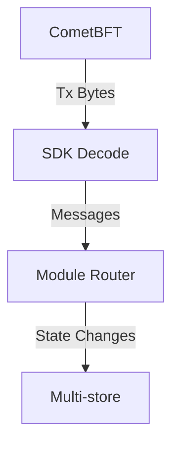
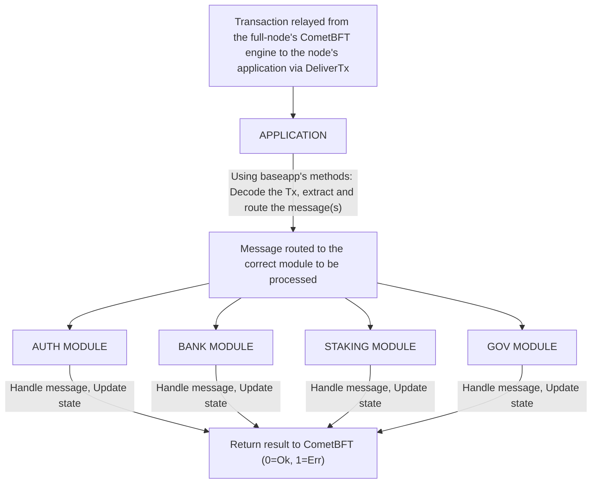
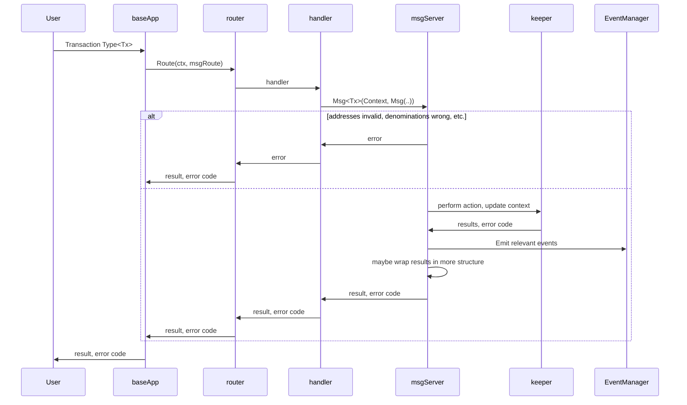
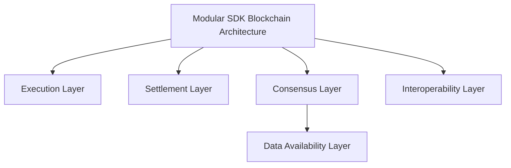
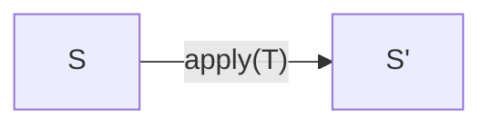
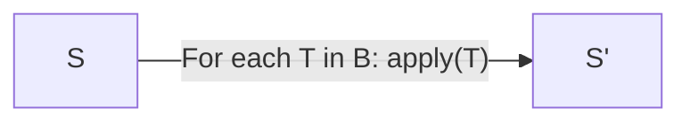
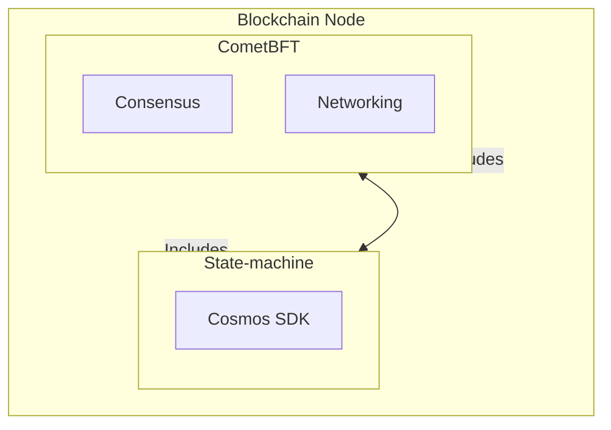
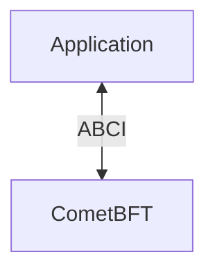
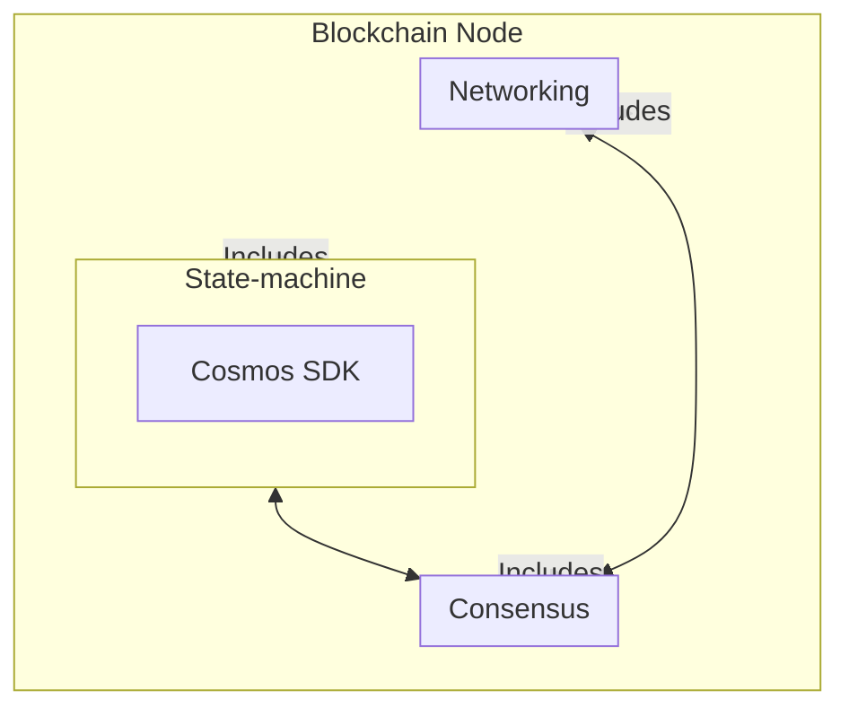

# Cosmos SDK Core Components

## Overview

The Cosmos SDK is a framework for building secure blockchain applications on CometBFT. It provides:

- ABCI implementation in Go
- Multi-store persistence layer  
- Transaction routing system

## Transaction Flow

1. CometBFT consensus delivers transaction bytes
2. SDK decodes transactions and extracts messages
3. Messages routed to appropriate modules
4. State changes committed to stores



## `baseapp`

`baseapp` is the boilerplate implementation of a Cosmos SDK application. It comes with an implementation of the ABCI to handle the connection with the underlying consensus engine. Typically, a Cosmos SDK application extends `baseapp` by embedding it in [`app.go`](../beginner/00-app-anatomy.md#core-application-file).

Here is an example of this from `simapp`, the Cosmos SDK demonstration app:

```go reference
https://github.com/cosmos/cosmos-sdk/blob/v0.52.0-beta.1/simapp/app.go#L145-L186
```

The goal of `baseapp` is to provide a secure interface between the store and the extensible state machine while defining as little about the state machine as possible (staying true to the ABCI).

For more on `baseapp`, please click [here](../advanced/00-baseapp.md).

## Multistore

The Cosmos SDK provides a [`multistore`](../advanced/04-store.md#multistore) for persisting state. The multistore allows developers to declare any number of [`KVStores`](../advanced/04-store.md#base-layer-kvstores). These `KVStores` only accept the `[]byte` type as value and therefore any custom structure needs to be marshalled using [a codec](../advanced/05-encoding.md) before being stored.

The multistore abstraction is used to divide the state in distinct compartments, each managed by its own module. For more on the multistore, click [here](../advanced/04-store.md#multistore).

## Modules

The power of the Cosmos SDK lies in its modularity. Cosmos SDK applications are built by aggregating a collection of interoperable modules. Each module defines a subset of the state and contains its own message/transaction processor, while the Cosmos SDK is responsible for routing each message to its respective module.

Here is a simplified view of how a transaction is processed by the application of each full-node when it is received in a valid block:



Each module can be seen as a little state-machine. Developers need to define the subset of the state handled by the module, as well as custom message types that modify the state (_Note:_ `messages` are extracted from `transactions` by `baseapp`). In general, each module declares its own `KVStore` in the `multistore` to persist the subset of the state it defines. Most developers will need to access other 3rd party modules when building their own modules. Given that the Cosmos SDK is an open framework, some of the modules may be malicious, which means there is a need for security principles to reason about inter-module interactions. These principles are based on [object-capabilities](../advanced/10-ocap.md). In practice, this means that instead of having each module keep an access control list for other modules, each module implements special objects called `keepers` that can be passed to other modules to grant a pre-defined set of capabilities.

Cosmos SDK modules are defined in the `x/` folder of the Cosmos SDK. Some core modules include:

- `x/auth`: Used to manage accounts and signatures.
- `x/bank`: Used to enable tokens and token transfers.
- `x/staking` + `x/slashing`: Used to build Proof-of-Stake blockchains.

In addition to the already existing modules in `x/`, which anyone can use in their app, the Cosmos SDK lets you build your own custom modules. You can check an [example of that in the tutorial](https://tutorials.cosmos.network/).# Keepers

:::note Synopsis
`Keeper`s refer to a Cosmos SDK abstraction whose role is to manage access to the subset of the state defined by various modules. `Keeper`s are module-specific, i.e. the subset of state defined by a module can only be accessed by a `keeper` defined in said module. If a module needs to access the subset of state defined by another module, a reference to the second module's internal `keeper` needs to be passed to the first one. This is done in `app.go` during the instantiation of module keepers.
:::

:::note Pre-requisite Readings

- [Introduction to Cosmos SDK Modules](./00-intro.md)

:::

## Motivation

The Cosmos SDK is a framework that makes it easy for developers to build complex decentralized applications from scratch, mainly by composing modules together. As the ecosystem of open-source modules for the Cosmos SDK expands, it will become increasingly likely that some of these modules contain vulnerabilities, as a result of the negligence or malice of their developer.

The Cosmos SDK adopts an [object-capabilities-based approach](https://docs.cosmos.network/main/learn/advanced/ocap#ocaps-in-practice) to help developers better protect their application from unwanted inter-module interactions, and `keeper`s are at the core of this approach. A `keeper` can be considered quite literally to be the gatekeeper of a module's store(s). Each store (typically an [`IAVL` Store](../../learn/advanced/04-store.md#iavl-store)) defined within a module comes with a `storeKey`, which grants unlimited access to it. The module's `keeper` holds this `storeKey` (which should otherwise remain unexposed), and defines [methods](#implementing-methods) for reading and writing to the store(s).

The core idea behind the object-capabilities approach is to only reveal what is necessary to get the work done. In practice, this means that instead of handling permissions of modules through access-control lists, module `keeper`s are passed a reference to the specific instance of the other modules' `keeper`s that they need to access (this is done in the [application's constructor function](../../learn/beginner/00-app-anatomy.md#constructor-function)). As a consequence, a module can only interact with the subset of state defined in another module via the methods exposed by the instance of the other module's `keeper`. This is a great way for developers to control the interactions that their own module can have with modules developed by external developers.

## Type Definition

`keeper`s are generally implemented in a `/keeper/keeper.go` file located in the module's folder. By convention, the type `keeper` of a module is simply named `Keeper` and usually follows the following structure:

```go
type Keeper struct {
    // External keepers, if any

    // Store key(s)

    // codec

    // authority
}
```

For example, here is the type definition of the `keeper` from the `staking` module:

```go reference
https://github.com/cosmos/cosmos-sdk/blob/v0.52.0-beta.1/x/staking/keeper/keeper.go#L54-L115
```

Let us go through the different parameters:

- An expected `keeper` is a `keeper` external to a module that is required by the internal `keeper` of said module. External `keeper`s are listed in the internal `keeper`'s type definition as interfaces. These interfaces are themselves defined in an `expected_keepers.go` file in the root of the module's folder. In this context, interfaces are used to reduce the number of dependencies, as well as to facilitate the maintenance of the module itself.
- `KVStoreService`s grant access to the store(s) of the [multistore](../../learn/advanced/04-store.md) managed by the module. They should always remain unexposed to external modules.
- `cdc` is the [codec](../../learn/advanced/05-encoding.md) used to marshal and unmarshal structs to/from `[]byte`. The `cdc` can be any of `codec.BinaryCodec`, `codec.JSONCodec` or `codec.Codec` based on your requirements. It can be either a proto or amino codec as long as they implement these interfaces.
- The authority listed is a module account or user account that has the right to change module level parameters. Previously this was handled by the param module, which has been deprecated.

Of course, it is possible to define different types of internal `keeper`s for the same module (e.g. a read-only `keeper`). Each type of `keeper` comes with its own constructor function, which is called from the [application's constructor function](../../learn/beginner/00-app-anatomy.md). This is where `keeper`s are instantiated, and where developers make sure to pass correct instances of modules' `keeper`s to other modules that require them.

## Implementing Methods

`Keeper`s primarily expose methods for business logic, as validity checks should have already been performed by the [`Msg` server](./03-msg-services.md) when `keeper`s' methods are called.

<!-- markdown-link-check-disable -->

State management is recommended to be done via [Collections](../packages/collections)

<!-- The above link is created via the script to generate docs  -->

## State Management

In the Cosmos SDK, it is crucial to be methodical and selective when managing state within a module, as improper state management can lead to inefficiency, security risks, and scalability issues. Not all data belongs in the on-chain state; it's important to store only essential blockchain data that needs to be verified by consensus. Storing unnecessary information, especially client-side data, can bloat the state and slow down performance. Instead, developers should focus on using an off-chain database to handle supplementary data, extending the API as needed. This approach minimizes on-chain complexity, optimizes resource usage, and keeps the blockchain state lean and efficient, ensuring scalability and smooth operations.

The Cosmos SDK leverages Protocol Buffers (protobuf) for efficient state management, providing a well-structured, binary encoding format that ensures compatibility and performance across different modules. The SDK’s recommended approach for managing state is through the [collections package](../pacakges/02-collections.md), which simplifies state handling by offering predefined data structures like maps and indexed sets, reducing the complexity of managing raw state data. While users can opt for custom encoding schemes if they need more flexibility or have specialized requirements, they should be aware that such custom implementations may not integrate seamlessly with indexers that decode state data on the fly. This could lead to challenges in data retrieval, querying, and interoperability, making protobuf a safer and more future-proof choice for most use cases.

# Folder Structure

:::note Synopsis
This document outlines the structure of Cosmos SDK modules. These ideas are meant to be applied as suggestions. Application developers are encouraged to improve upon and contribute to module structure and development design.

The required interface for a module is located in the module.go. Everything beyond this is suggestive.
:::

## Structure

A typical Cosmos SDK module can be structured as follows:

```shell
proto
└── {project_name}
    └── {module_name}
        └── {proto_version}
            ├── {module_name}.proto
            ├── genesis.proto
            ├── query.proto
            └── tx.proto
```

- `{module_name}.proto`: The module's common message type definitions.
- `genesis.proto`: The module's message type definitions related to genesis state.
- `query.proto`: The module's Query service and related message type definitions.
- `tx.proto`: The module's Msg service and related message type definitions.

```shell
x/{module_name}
├── client
│   ├── cli
│   │   ├── query.go
│   │   └── tx.go
│   └── testutil
│       ├── cli_test.go
│       └── suite.go
├── exported
│   └── exported.go
├── keeper
│   ├── genesis.go
│   ├── grpc_query.go
│   ├── hooks.go
│   ├── invariants.go
│   ├── keeper.go
│   ├── keys.go
│   ├── msg_server.go
│   └── querier.go
├── simulation
│   ├── decoder.go
│   ├── genesis.go
│   ├── operations.go
│   └── params.go
├── types
│   ├── {module_name}.pb.go
│   ├── codec.go
│   ├── errors.go
│   ├── events.go
│   ├── events.pb.go
│   ├── expected_keepers.go
│   ├── genesis.go
│   ├── genesis.pb.go
│   ├── keys.go
│   ├── msgs.go
│   ├── params.go
│   ├── query.pb.go
│   └── tx.pb.go
├── module.go
├── abci.go
├── autocli.go
├── depinject.go
└── README.md
```

- `client/`: The module's CLI client functionality implementation and the module's CLI testing suite.
- `exported/`: The module's exported types - typically interface types. If a module relies on keepers from another module, it is expected to receive the keepers as interface contracts through the `expected_keepers.go` file (see below) in order to avoid a direct dependency on the module implementing the keepers. However, these interface contracts can define methods that operate on and/or return types that are specific to the module that is implementing the keepers and this is where `exported/` comes into play. The interface types that are defined in `exported/` use canonical types, allowing for the module to receive the keepers as interface contracts through the `expected_keepers.go` file. This pattern allows for code to remain DRY and also alleviates import cycle chaos.
- `keeper/`: The module's `Keeper` and `MsgServer` implementation.
  - `abci.go`: The module's `BeginBlocker` and `EndBlocker` implementations (this file is only required if `BeginBlocker` and/or `EndBlocker` need to be defined).
- `simulation/`: The module's [simulation](./14-simulator.md) package defines functions used by the blockchain simulator application (`simapp`).
- `README.md`: The module's specification documents outlining important concepts, state storage structure, and message and event type definitions. Learn more how to write module specs in the [spec guidelines](../spec/SPEC_MODULE.md).
- `types/`: includes type definitions for messages, events, and genesis state, including the type definitions generated by Protocol Buffers.
  - `codec.go`: The module's registry methods for interface types.
  - `errors.go`: The module's sentinel errors.
  - `events.go`: The module's event types and constructors.
  - `expected_keepers.go`: The module's [expected keeper](./06-keeper.md#type-definition) interfaces.
  - `genesis.go`: The module's genesis state methods and helper functions.
  - `keys.go`: The module's store keys and associated helper functions.
  - `msgs.go`: The module's message type definitions and associated methods.
  - `params.go`: The module's parameter type definitions and associated methods.
  - `*.pb.go`: The module's type definitions generated by Protocol Buffers (as defined in the respective `*.proto` files above).
- The root directory includes the module's `AppModule` implementation.
  - `autocli.go`: The module [autocli](https://docs.cosmos.network/main/core/autocli) options.
  - `depinject.go`: The module [depinject](./15-depinject.md#type-definition) options.

> Note: although the above pattern is followed by most of the Cosmos SDK modules, there are some modules that don't follow this pattern. E.g `x/group` and `x/nft` dont have a `types` folder, instead all of the type definitions for messages, events, and genesis state are live in the root directory and the module's `AppModule` implementation lives in the `module` folder.

---

## sidebar_position: 1

# `Msg` Services

:::note Synopsis
A Protobuf `Msg` service processes [messages](./02-messages-and-queries.md#messages). Protobuf `Msg` services are specific to the module in which they are defined, and only process messages defined within the said module. They are called from `BaseApp` during [`FinalizeBlock`](../../learn/advanced/00-baseapp.md#finalizeblock).
:::

:::note Pre-requisite Readings

- [Module Manager](./01-module-manager.md)
- [Messages and Queries](./02-messages-and-queries.md)

:::

## Implementation of a module `Msg` service

Each module should define a Protobuf `Msg` service, which will be responsible for processing requests (implementing `sdk.Msg`) and returning responses.

As further described in [ADR 031](../architecture/adr-031-msg-service.md), this approach has the advantage of clearly specifying return types and generating server and client code.

Protobuf generates a `MsgServer` interface based on the definition of `Msg` service. It is the role of the module developer to implement this interface, by implementing the state transition logic that should happen upon receival of each `transaction.Msg`. As an example, here is the generated `MsgServer` interface for `x/bank`, which exposes two `transaction.Msg`s:

```go reference
https://github.com/cosmos/cosmos-sdk/blob/28fa3b8/x/bank/types/tx.pb.go#L564-L579
```

When possible, the existing module's [`Keeper`](./06-keeper.md) should implement `MsgServer`, otherwise a `msgServer` struct that embeds the `Keeper` can be created, typically in `./keeper/msg_server.go`:

```go reference
https://github.com/cosmos/cosmos-sdk/blob/28fa3b8/x/bank/keeper/msg_server.go#L16-L19
```

`msgServer` methods can retrieve the auxiliary information or services using the environment variable, it is always located in the keeper:

Environment:

```go reference
https://github.com/cosmos/cosmos-sdk/blob/07151304e2ec6a185243d083f59a2d543253cb15/core/appmodule/v2/environment.go#L14-L29
```

Keeper Example:

```go reference
https://github.com/cosmos/cosmos-sdk/blob/07151304e2ec6a185243d083f59a2d543253cb15/x/bank/keeper/keeper.go#L56-L58
```

`transaction.Msg` processing usually follows these 3 steps:

### Validation

The message server must perform all validation required (both _stateful_ and _stateless_) to make sure the `message` is valid.
The `signer` is charged for the gas cost of this validation.

For example, a `msgServer` method for a `transfer` message should check that the sending account has enough funds to actually perform the transfer.

It is recommended to implement all validation checks in a separate function that passes state values as arguments. This implementation simplifies testing. As expected, expensive validation functions charge additional gas. Example:

```go
ValidateMsgA(msg MsgA, now Time, gm GasMeter) error {
	if now.Before(msg.Expire) {
		return sdkerrors.ErrInvalidRequest.Wrap("msg expired")
	}
	gm.ConsumeGas(1000, "signature verification")
	return signatureVerificaton(msg.Prover, msg.Data)
}
```

:::warning
Previously, the `ValidateBasic` method was used to perform simple and stateless validation checks.
This way of validating is deprecated, this means the `msgServer` must perform all validation checks.
:::

### State Transition

After the validation is successful, the `msgServer` method uses the [`keeper`](./06-keeper.md) functions to access the state and perform a state transition.

### Events

Before returning, `msgServer` methods generally emit one or more [events](../../learn/advanced/08-events.md) by using the `EventManager` held in `environment`.

There are two ways to emit events, typed events using protobuf or arbitrary key & values.

Typed Events:

```go
ctx.EventManager().EmitTypedEvent(
	&group.EventABC{Key1: Value1,  Key2, Value2})
```

Arbitrary Events:

```go
ctx.EventManager().EmitEvent(
	sdk.NewEvent(
		eventType,  // e.g. sdk.EventTypeMessage for a message, types.CustomEventType for a custom event defined in the module
		sdk.NewAttribute(key1, value1),
		sdk.NewAttribute(key2, value2),
	),
)
```

These events are relayed back to the underlying consensus engine and can be used by service providers to implement services around the application. Click [here](../../learn/advanced/08-events.md) to learn more about events.

The invoked `msgServer` method returns a `proto.Message` response and an `error`. These return values are then wrapped into an `*sdk.Result` or an `error`:

```go reference
https://github.com/cosmos/cosmos-sdk/blob/v0.50.0-alpha.0/baseapp/msg_service_router.go#L160
```

This method takes care of marshaling the `res` parameter to protobuf and attaching any events on the `EventManager()` to the `sdk.Result`.

```protobuf reference
https://github.com/cosmos/cosmos-sdk/blob/v0.50.0-alpha.0/proto/cosmos/base/abci/v1beta1/abci.proto#L93-L113
```

This diagram shows a typical structure of a Protobuf `Msg` service, and how the message propagates through the module.



## Telemetry

New [telemetry metrics](../../learn/advanced/09-telemetry.md) can be created from `msgServer` methods when handling messages.

This is an example from the `x/auth/vesting` module:

```go reference
https://github.com/cosmos/cosmos-sdk/blob/v0.50.0-alpha.0/x/auth/vesting/msg_server.go#L76-L88
```

:::Warning
Telemetry adds a performance overhead to the chain. It is recommended to only use this in critical paths
:::

---

## sidebar_position: 1

# Query Services

:::note Synopsis
A Protobuf Query service processes [`queries`](./02-messages-and-queries.md#queries). Query services are specific to the module in which they are defined, and only process `queries` defined within said module. They are called from `BaseApp`'s [`Query` method](../../learn/advanced/00-baseapp.md#query).
:::

:::note Pre-requisite Readings

- [Module Manager](./01-module-manager.md)
- [Messages and Queries](./02-messages-and-queries.md)

:::

## Implementation of a module query service

### gRPC Service

When defining a Protobuf `Query` service, a `QueryServer` interface is generated for each module with all the service methods:

```go
type QueryServer interface {
	QueryBalance(context.Context, *QueryBalanceParams) (*types.Coin, error)
	QueryAllBalances(context.Context, *QueryAllBalancesParams) (*QueryAllBalancesResponse, error)
}
```

These custom queries methods should be implemented by a module's keeper, typically in `./keeper/grpc_query.go`. The first parameter of these methods is a generic `context.Context`. Therefore, the Cosmos SDK provides a function `sdk.UnwrapSDKContext` to retrieve the `context.Context` from the provided
`context.Context`.

Here's an example implementation for the bank module:

```go reference
https://github.com/cosmos/cosmos-sdk/blob/v0.50.0-alpha.0/x/bank/keeper/grpc_query.go
```

### Calling queries from the State Machine

The Cosmos SDK v0.47 introduces a new `cosmos.query.v1.module_query_safe` Protobuf annotation which is used to state that a query that is safe to be called from within the state machine, for example:

- a Keeper's query function can be called from another module's Keeper,
- ADR-033 intermodule query calls,
- CosmWasm contracts can also directly interact with these queries.

If the `module_query_safe` annotation set to `true`, it means:

- The query is deterministic: given a block height it will return the same response upon multiple calls, and doesn't introduce any state-machine breaking changes across SDK patch versions.
- Gas consumption never fluctuates across calls and across patch versions.

If you are a module developer and want to use `module_query_safe` annotation for your own query, you have to ensure the following things:

- the query is deterministic and won't introduce state-machine-breaking changes without coordinated upgrades
- it has its gas tracked, to avoid the attack vector where no gas is accounted for
  on potentially high-computation queries.

  ***

  sidebar_position: 1

---

# Blockchain Architecture

## Introduction

Blockchain architecture is a complex topic that involves many different components. In this section, we will cover the main layers of a blockchain application built with the Cosmos SDK.

At its core, a blockchain is a replicated deterministic state machine. This document explores the various layers of blockchain architecture, focusing on the execution, settlement, consensus, data availability, and interoperability layers.



## Layered Architecture

Understanding blockchain architecture through the lens of different layers helps in comprehending its complex functionalities. We will give a high-level overview of the execution layer, settlement layer, consensus layer, data availability layer, and interoperability layer.

## Execution Layer

The Execution Layer is where the blockchain processes and executes transactions. The state machine within the blockchain handles the execution of transaction logic. This is done by the blockchain itself, ensuring that every transaction follows the predefined rules and state transitions. When a transaction is submitted, the execution layer processes it, updates the state, and ensures that the output is deterministic and consistent across all nodes. In the context of the Cosmos SDK, this typically involves predefined modules and transaction types rather than general-purpose smart contracts, which are used in chains with CosmWasm.

### State machine

At its core, a blockchain is a [replicated deterministic state machine](https://en.wikipedia.org/wiki/State_machine_replication).

A state machine is a computer science concept whereby a machine can have multiple states, but only one at any given time. There is a `state`, which describes the current state of the system, and `transactions`, that trigger state transitions.

Given a state S and a transaction T, the state machine will return a new state S'.



In practice, the transactions are bundled in blocks to make the process more efficient. Given a state S and a block of transactions B, the state machine will return a new state S'.



In a blockchain context, the state machine is [deterministic](https://en.wikipedia.org/wiki/Deterministic_system). This means that if a node is started at a given state and replays the same sequence of transactions, it will always end up with the same final state.

The Cosmos SDK gives developers maximum flexibility to define the state of their application, transaction types and state transition functions. The process of building state machines with the Cosmos SDK will be described more in-depth in the following sections. But first, let us see how the state machine is replicated using various consensus engines, such as CometBFT.

## Settlement Layer

The Settlement Layer is responsible for finalising and recording transactions on the blockchain. This layer ensures that all transactions are accurately settled and immutable, providing a verifiable record of all activities on the blockchain. It is critical for maintaining the integrity and trustworthiness of the blockchain.

The settlement layer can be performed on the chain itself or it can be externalised, allowing for the possibility of plugging in a different settlement layer as needed. For example if we were to use Rollkit and celestia for our Data Availability and Consensus, we could separate our settlement layer by introducing fraud or validity proofs. From there the settlement layer can create trust-minimised light clients, further enhancing security and efficiency. This process ensures that all transactions are accurately finalized and immutable, providing a verifiable record of all activities.

## Consensus Layer

The Consensus Layer ensures that all nodes in the network agree on the order and validity of transactions. This layer uses consensus algorithms like Byzantine Fault Tolerance (BFT) or Proof of Stake (PoS) to achieve agreement, even in the presence of malicious nodes. Consensus is crucial for maintaining the security and reliability of the blockchain.

What has been a default consensus engine in the Cosmos SDK has been CometBFT. In the most recent releases we have been moving away from this and allowing users to plug and play their own consensus engines. This is a big step forward for the Cosmos SDK as it allows for more flexibility and customisation. Other consensus engine options for example can be Rollkit with Celestias Data Availability Layer.

Here is an example of how the consensus layer works with CometBFT in the context of the Cosmos SDK:

### CometBFT

Thanks to the Cosmos SDK, developers just have to define the state machine, and [_CometBFT_](https://docs.cometbft.com/v1.0/explanation/introduction/) will handle replication over the network for them.



[CometBFT](https://docs.cometbft.com/v1.0/explanation/introduction/) is an application-agnostic engine that is responsible for handling the _networking_ and _consensus_ layers of a blockchain. In practice, this means that CometBFT is responsible for propagating and ordering transaction bytes. CometBFT relies on an eponymous Byzantine-Fault-Tolerant (BFT) algorithm to reach consensus on the order of transactions.

The [consensus algorithm adopted by CometBFT](https://docs.cometbft.com/v1.0/explanation/introduction/#consensus-overview) works with a set of special nodes called _Validators_. Validators are responsible for adding blocks of transactions to the blockchain. At any given block, there is a validator set V. A validator in V is chosen by the algorithm to be the proposer of the next block. This block is considered valid if more than two thirds of V signed a `prevote` and a `precommit` on it, and if all the transactions that it contains are valid. The validator set can be changed by rules written in the state-machine.

## ABCI

CometBFT passes transactions to the application through an interface called the [ABCI](https://docs.cometbft.com/v1.0/spec/abci/), which the application must implement.



Note that **CometBFT only handles transaction bytes**. It has no knowledge of what these bytes mean. All CometBFT does is order these transaction bytes deterministically. CometBFT passes the bytes to the application via the ABCI, and expects a return code to inform it if the messages contained in the transactions were successfully processed or not.

Here are the most important messages of the ABCI:

- `CheckTx`: When a transaction is received by CometBFT, it is passed to the application to check if a few basic requirements are met. `CheckTx` is used to protect the mempool of full-nodes against spam transactions. A special handler called the [`AnteHandler`](../beginner/04-gas-fees.md#antehandler) is used to execute a series of validation steps such as checking for sufficient fees and validating the signatures. If the checks are valid, the transaction is added to the [mempool](https://docs.cometbft.com/v1.0/explanation/core/mempool) and relayed to peer nodes. Note that transactions are not processed (i.e. no modification of the state occurs) with `CheckTx` since they have not been included in a block yet.
- `DeliverTx`: When a [valid block](https://docs.cometbft.com/v1.0/spec/core/data_structures#block) is received by CometBFT, each transaction in the block is passed to the application via `DeliverTx` in order to be processed. It is during this stage that the state transitions occur. The `AnteHandler` executes again, along with the actual [`Msg` service](../../build/building-modules/03-msg-services.md) RPC for each message in the transaction.
- `BeginBlock`/`EndBlock`: These messages are executed at the beginning and the end of each block, whether the block contains transactions or not. It is useful to trigger automatic execution of logic. Proceed with caution though, as computationally expensive loops could slow down your blockchain, or even freeze it if the loop is infinite.

Find a more detailed view of the ABCI methods from the [CometBFT docs](https://docs.cometbft.com/v1.0/spec/abci/).

Any application built on CometBFT needs to implement the ABCI interface in order to communicate with the underlying local CometBFT engine. Fortunately, you do not have to implement the ABCI interface. The Cosmos SDK provides a boilerplate implementation of it in the form of [baseapp](./03-sdk-design.md#baseapp).

## Data Availability Layer

The Data Availability (DA) Layer is a critical component of within the umbrella of the consensus layer that ensures all necessary data for transactions is available to all network participants. This layer is essential for preventing data withholding attacks, where some nodes might attempt to disrupt the network by not sharing critical transaction data.

If we use the example of Rollkit, a user initiates a transaction, which is then propagated through the rollup network by a light node. The transaction is validated by full nodes and aggregated into a block by the sequencer. This block is posted to a data availability layer like Celestia, ensuring the data is accessible and correctly ordered. The rollup light node verifies data availability from the DA layer. Full nodes then validate the block and generate necessary proofs, such as fraud proofs for optimistic rollups or zk-SNARKs/zk-STARKs for zk-rollups. These proofs are shared across the network and verified by other nodes, ensuring the rollup's integrity. Once all validations are complete, the rollup's state is updated, finalising the transaction

## Interoperability Layer

The Interoperability Layer enables communication and interaction between different blockchains. This layer facilitates cross-chain transactions and data sharing, allowing various blockchain networks to interoperate seamlessly. Interoperability is key for building a connected ecosystem of blockchains, enhancing their functionality and reach.

In this case we have separated the layers even further to really illustrate the components that make-up the blockchain architecture and it is important to note that the Cosmos SDK is designed to be interoperable with other blockchains. This is achieved through the use of the [Inter-Blockchain Communication (IBC) protocol](https://www.ibcprotocol.dev/), which allows different blockchains to communicate and transfer assets between each other.

---

## sidebar_position: 1

# Application-Specific Blockchains

:::note Synopsis
This document explains what application-specific blockchains are, and why developers would want to build one as opposed to writing Smart Contracts.
:::

## What are application-specific blockchains

Application-specific blockchains are blockchains customized to operate a single application. Instead of building a decentralized application on top of an underlying blockchain like Ethereum, developers build their own blockchain from the ground up. This means building a full-node client, a light-client, and all the necessary interfaces (CLI, REST, ...) to interact with the nodes.



## What are the shortcomings of Smart Contracts

Virtual-machine blockchains like Ethereum addressed the demand for more programmability back in 2014. At the time, the options available for building decentralized applications were quite limited. Most developers would build on top of the complex and limited Bitcoin scripting language, or fork the Bitcoin codebase which was hard to work with and customize.

Virtual-machine blockchains came in with a new value proposition. Their state-machine incorporates a virtual-machine that is able to interpret turing-complete programs called Smart Contracts. These Smart Contracts are very good for use cases like one-time events (e.g. ICOs), but they can fall short for building complex decentralized platforms. Here is why:

- Smart Contracts are generally developed with specific programming languages that can be interpreted by the underlying virtual-machine. These programming languages are often immature and inherently limited by the constraints of the virtual-machine itself. For example, the Ethereum Virtual Machine does not allow developers to implement automatic execution of code. Developers are also limited to the account-based system of the EVM, and they can only choose from a limited set of functions for their cryptographic operations. These are examples, but they hint at the lack of **flexibility** that a smart contract environment often entails.
- Smart Contracts are all run by the same virtual machine. This means that they compete for resources, which can severely restrain **performance**. And even if the state-machine were to be split in multiple subsets (e.g. via sharding), Smart Contracts would still need to be interpreted by a virtual machine, which would limit performance compared to a native application implemented at state-machine level (our benchmarks show an improvement on the order of 10x in performance when the virtual-machine is removed).
- Another issue with the fact that Smart Contracts share the same underlying environment is the resulting limitation in **sovereignty**. A decentralized application is an ecosystem that involves multiple players. If the application is built on a general-purpose virtual-machine blockchain, stakeholders have very limited sovereignty over their application, and are ultimately superseded by the governance of the underlying blockchain. If there is a bug in the application, very little can be done about it.

Application-Specific Blockchains are designed to address these shortcomings.

## Application-Specific Blockchains Benefits

### Flexibility

Application-specific blockchains give maximum flexibility to developers:

- In Cosmos blockchains, the state-machine is typically connected to the underlying consensus engine via an interface called the [ABCI](https://docs.cometbft.com/v1.0/spec/abci/) (Application Blockchain Interface). This interface can be wrapped in any programming language, meaning developers can build their state-machine in the programming language of their choice.

- Developers can choose among multiple frameworks to build their state-machine. The most widely used today is the Cosmos SDK, but others exist (e.g. [Lotion](https://github.com/nomic-io/lotion), [Weave](https://github.com/iov-one/weave), ...). Typically the choice will be made based on the programming language they want to use (Cosmos SDK and Weave are in Golang, Lotion is in Javascript, ...).
- The ABCI also allows developers to swap the consensus engine of their application-specific blockchain. Today, only CometBFT is production-ready, but in the future other consensus engines are expected to emerge.
- Even when they settle for a framework and consensus engine, developers still have the freedom to tweak them if they don't perfectly match their requirements in their pristine forms.
- Developers are free to explore the full spectrum of tradeoffs (e.g. number of validators vs transaction throughput, safety vs availability in asynchrony, ...) and design choices (DB or IAVL tree for storage, UTXO or account model, ...).
- Developers can implement automatic execution of code. In the Cosmos SDK, logic can be automatically triggered at the beginning and the end of each block. They are also free to choose the cryptographic library used in their application, as opposed to being constrained by what is made available by the underlying environment in the case of virtual-machine blockchains.

The list above contains a few examples that show how much flexibility application-specific blockchains give to developers. The goal of Cosmos and the Cosmos SDK is to make developer tooling as generic and composable as possible, so that each part of the stack can be forked, tweaked and improved without losing compatibility. As the community grows, more alternatives for each of the core building blocks will emerge, giving more options to developers.

### Performance

Decentralized applications built with Smart Contracts are inherently capped in performance by the underlying environment. For a decentralized application to optimise performance, it needs to be built as an application-specific blockchain. Next are some of the benefits an application-specific blockchain brings in terms of performance:

- Developers of application-specific blockchains can choose to operate with a novel consensus engine such as CometBFT.
- An application-specific blockchain only operates a single application, so that the application does not compete with others for computation and storage. This is the opposite of most non-sharded virtual-machine blockchains today, where smart contracts all compete for computation and storage.
- Even if a virtual-machine blockchain offered application-based sharding coupled with an efficient consensus algorithm, performance would still be limited by the virtual-machine itself. The real throughput bottleneck is the state-machine, and requiring transactions to be interpreted by a virtual-machine significantly increases the computational complexity of processing them.

### Security

Security is hard to quantify, and greatly varies from platform to platform. That said here are some important benefits an application-specific blockchain can bring in terms of security:

- Developers can choose proven programming languages like Go when building their application-specific blockchains, as opposed to smart contract programming languages that are often more immature.
- Developers are not constrained by the cryptographic functions made available by the underlying virtual-machines. They can use their own custom cryptography, and rely on well-audited crypto libraries.
- Developers do not have to worry about potential bugs or exploitable mechanisms in the underlying virtual-machine, making it easier to reason about the security of the application.

### Sovereignty

One of the major benefits of application-specific blockchains is sovereignty. A decentralized application is an ecosystem that involves many actors: users, developers, third-party services, and more. When developers build on virtual-machine blockchain where many decentralized applications coexist, the community of the application is different than the community of the underlying blockchain, and the latter supersedes the former in the governance process. If there is a bug or if a new feature is needed, stakeholders of the application have very little leeway to upgrade the code. If the community of the underlying blockchain refuses to act, nothing can happen.

The fundamental issue here is that the governance of the application and the governance of the network are not aligned. This issue is solved by application-specific blockchains. Because application-specific blockchains specialize to operate a single application, stakeholders of the application have full control over the entire chain. This ensures that the community will not be stuck if a bug is discovered, and that it has the freedom to choose how it is going to evolve.
