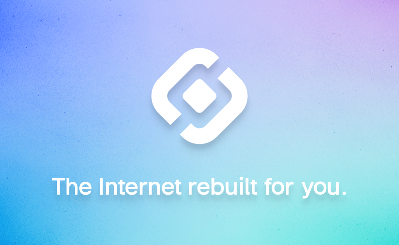

<p align="center">
  <a href="" rel="noopener">
 </a>
</p>

<h1 align="center"><bold>Sonr</bold></h1>

<div align="center">

[](https://www.codefactor.io/repository/github/sonr-io/sonr)
  [](https://sonr.io)
  [](https://pkg.go.dev/github.com/sonr-io/sonr)
  [](https://goreportcard.com/report/github.com/sonr-io/sonr)
  [](https://github.com/sonr-io/sonr/issues)
  [](https://github.com/sonr-io/sonr/pulls)
  [](/LICENSE)

</div>

---

<p align="center"> Build <strong>privacy-preserving</strong>, <strong>user-centric applications</strong>, on a robust, rapid-scaling platform designed for interoperability, and total digital autonomy.
    <br>
</p>

## 📝 Table of Contents
- [About](#about)
- [Getting Started](#getting_started)
- [Deployment](#deployment)
- [Usage](#usage)
- [Built Using](#built_using)
- [Contributing](./docs/guides/CONTRIBUTING.md)
- [Authors](#authors)
- [Acknowledgments](#acknowledgement)

## 🧐 About <a name = "about"></a>
Sonr aims to be the most immersive and powerful DWeb experience for both Users and Developers alike. We believe the best way to onboard the next billion users is to create a cohesive end-to-end platform that’s composable and interoperable with all existing protocols.

For a more in-depth technical look into the Sonr ecosystem please refer to the [Architecture Decision Records](./docs/architecture/GUIDE.md).


## 🏁 Getting Started <a name = "getting_started"></a>
These instructions will get you a copy of the project up and running on your local machine for development and testing purposes. See [deployment](#-deployment-) for notes on how to deploy the project on a live system.

### Prerequisites
What things you need to install the software and how to install them.
- [Go](https://golang.org/doc/install) - v1.18.*
- [Ignite CLI](https://github.com/ignite/cli) - v0.24.1
- [Cosmos SDK](https://cosmos.network/docs/getting-started/installation.html) - v0.45.5
- [Protocol Buffers](https://grpc.io)

### Installing
A step by step series of examples that tell you how to get a development env running.

Installing Protocol Buffers

```bash
brew install protobuf
```

Installing Ignite

```bash
curl https://get.ignite.com/cli! | bash
```

Installing Gomobile - for building the Motor library

```bash
go install golang.org/x/mobile/cmd/gomobile@latest
gomobile init
```

## 🔧 Running the tests <a name = "tests"></a>
Explain how to run the automated tests for this system.

### Setup Test Environment

Create file named **.env** in project root and set the following variables:
```
BLOCKCHAIN_REST=
BLOCKCHAIN_FAUCET=
BLOCKCHAIN_RPC=
IPFS_ADDRESS=
IPFS_API_ADDRESS=
VAULT_API_ADDRESS=
VAULT_ENDPOINT=
```

Refer to **.env.example** for typical values to use. If not set, default values will be used in place.

### Motor Node Tests


Run a test for a specific method
```bash
cd pkg/motor
go test -run CreateAccount
```

Run a specfic test inside a test suite
```bash
cd pkg/motor
go test -run MotorTestSuite -testify.m LoginWithKeys
```

Run a test suite
```bash
cd pkg/motor
go test -run MotorTestSuite
```

Run <b>ALL</b> motor tests
```bash
cd pkg/motor
go test
```

### Blockchain Tests

Get the chain running
```bash
ignite chain serve
```

Test it with `grpc_cli`
```bash
grpc_cli ls 137.184.190.146:9090 sonrio.sonr.bucket.Query
```
Outputs:
```
Params
WhereIs
WhereIsByCreator
WhereIsAll
```

Running simulation tests
```bash
ignite chain simulate
```

## 🎈 Usage <a name="usage"></a>
This repo serves as a **pseudo-monorepo** for the Sonr platform. You can find details on the organization of this project in [structure](./docs/guides/STRUCTURE.md).
- [Working the Makefile](./docs/guides/USAGE.md#working-the-makefile)
- [Submitting a Proposal](https://github.com/sonr-io/sonr/discussions/521)
- [Deploying Nodes](./docs/guides/DEPLOYMENT.md)

## ⛏️ Built Using <a name = "built_using"></a>
List of the main frameworks and tools used to build this project.
- [Libp2p](https://github.com/libp2p/libp2p) - Networking layer
- [Cosmos](https://github.com/cosmos-sdk/cosmos) - Blockchain Framework
- [IPFS](https://github.com/ipfs/ipfs) - Storage Module
- [HNS](https://handshake.org/) - Decentralized DNS

## ✍️ Authors <a name = "authors"></a>
See also the list of [contributors](https://github.com/sonr-io/sonr/contributors) who participated in this project.
- [Prad Nukala](https://github.com/prnk28)
- [Nick Tindle](https://github.com/ntindle)
- [Josh Long](https://github.com/joshLong145)
- [Brayden Cloud](https://github.com/mcjcloud)
- [Ian Perez](https://github.com/brokecollegekidwithaclothingobsession)

## 🎉 Acknowledgements <a name = "acknowledgement"></a>
Partners, collaborators, compliance, or just pure appreciation!
- [W3C](https://www.w3.org/)
- [Protocol Labs](https://protocol.ai/)
- [Ignite](https://ignite.com/)
