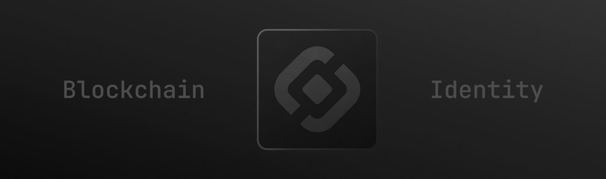
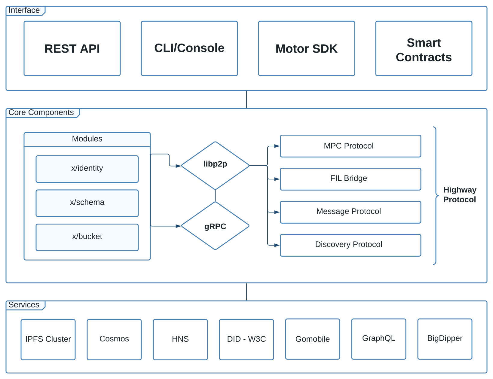
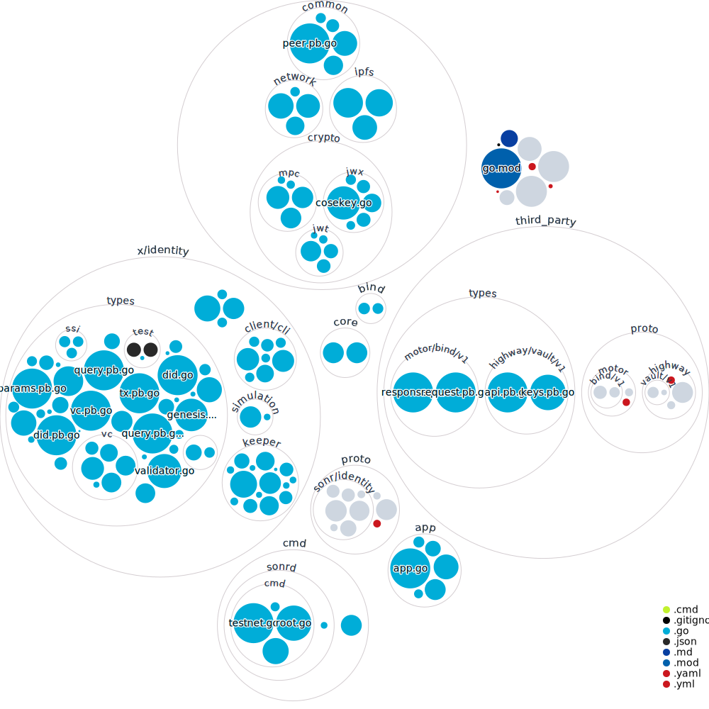

<div style="text-align: center;">

[](https://snr.la/h)

[](https://snapcraft.io/sonr)
[](https://pkg.go.dev/github.com/sonrhq/core)
[](https://goreportcard.com/report/github.com/sonrhq/core)
[](https://wakatime.com/badge/user/058be804-abc2-4536-854a-d9df25419807/project/5f8dabaf-b601-44c3-92b3-8b1a69e55936)
</div>

<p align="center"> Sonr is a <strong>peer-to-peer identity</strong> and <strong>asset management system</strong> that leverages <italic>DID Documents, WebAuthn, and IPFS</italic> - to provide users with a <strong>secure, user-friendly</strong> way to manage their <strong>digital identity and assets.</strong>
    <br>
</p>

## Getting Started

[](https://codespaces.new/sonrhq/core)

You can setup your macOS or Linux machine to be ready for local development with these steps:

```sh
git clone https://github.com/sonrhq/core.git       # Clone the repository
sh scripts/install.sh                               # Install dependencies
task                                                # Display the available commands
```

The `install.sh` script will install the following tools:

- [Ignite CLI](https://github.com/ignite/cli)
- [Taskfile](https://taskfile.dev)
- [Buf CLI](https://docs.buf.build/introduction)

You need to set the following environment variables to run the blockchain:

```sh
CONNECT_SERVER_HOST="localhost"
CONNECT_SERVER_PORT="8080"
TLS_CERT_FILE=""
TLS_KEY_FILE=""
ENVIRONMENT="dev"
HIGHWAY_MODE="fiber"
```


## Documentation

Sonr utilizes Mintlify to generate documentation from the source code. To view the documentation, execute `task docs` from the root directory. Or, visit the [documentation site](https://snr.la/docs).

<details>
<summary><strong>Architecture Diagram</strong></summary>



</details>

<details>
<summary><strong>Repository Structure Map</strong></summary>



</details>

## Usage

`task serve` command installs dependencies, builds, initializes, and starts your blockchain in development.

<details>
<summary><strong>Command Reference</strong></summary>

```sh
* docs                  Serve the docs locally
* chain:build:          Build the blockchain                  (aliases: build)
* chain:generate:       Generate the protobuf files           (aliases: gen)
* chain:serve:          Serve the blockchain locally          (aliases: serve)
* web                   Run the web app in dev mode           (aliases: web)
```
</details>
<details>
<summary><strong>Publish New Release</strong></summary>

To release a new version of your blockchain, create and push a new tag with `v` prefix. A new draft release with the configured targets will be created.

```sh
git tag v0.1
git push origin v0.1
```

After a draft release is created, make your final changes from the release page and publish it.

</details>

### Installation
To install the latest version of your blockchain node's binary, execute the following command on your machine:

```sh
curl https://get.ignite.com/sonrhq/core! | sudo bash
```
Production endpoints are available at the following URLs:

- REST API:    [api.sonr.ws](https://api.sonr.ws)
- Tendermint:  [rpc.sonr.ws](https://rpc.sonr.ws)
- gRPC Server: [grpc.sonr.ws](https://grpc.sonr.ws)

## Community

For help and discussion around DID Documents, best practices, and more, join us on [Discord](https://snr.la/dev-chat).

For updates on the Sonr Daemon, [follow this repo on GitHub](https://github.com/sonrhq/core).

For feature requests, bugs, or technical questions, [submit feedback here](https://roadmap.sonr.io). For general inquiries or inclusion in our upcoming feature betas, reach out on [Twitter](https://snr.la/tw).

# Additional Resources

## MPC

### Version 1

This is the second version of our MPC protocol which leverages the kryptology library from coinbase. This protocol uses DKG based signing for ecdsa signature generation. The protocol is described in the paper [here](https://eprint.iacr.org/2018/987.pdf).

### Version 0

This is the first version of the MPC protocol. It is a simple protocol that uses the taurusgroup implementation for CMP based ecdsa signature generation. The protocol is described in the paper [here](https://eprint.iacr.org/2017/552.pdf).
