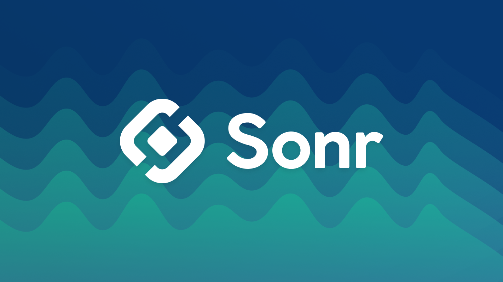

<div style="text-align: center;">

[](https://snr.la/h)

[](https://github.com/sonrhq/core)
[](https://app.buddy.works/sonr/sonr/pipelines/pipeline/428589)
[](https://pkg.go.dev/github.com/sonrhq/core)
[](https://goreportcard.com/report/github.com/sonrhq/core)


</div>

<p align="center"> Sonr is a <strong>peer-to-peer identity</strong> and <strong>asset management system</strong> that leverages <italic>DID Documents, WebAuthn, and IPFS</italic> - to provide users with a <strong>secure, user-friendly</strong> way to manage their <strong>digital identity and assets.</strong>
    <br>
</p>


## Getting Started

You can setup your macOS or Linux machine to be ready for local development with these steps:

```sh
git clone https://github.com/sonrhq/core.git       # Clone the repository
sh scripts/install.sh                               # Install dependencies
task                                                # Display the available commands
```

The `install.sh` script will install the following tools:

- [Ignite CLI](https://github.com/ignite/cli)
- [Taskfile](https://taskfile.dev)
- [Buf CLI](https://docs.buf.build/introduction)
- [Mintlify](https://mintlify.com/docs/development)

You need to set the following environment variables to run the blockchain:

```sh
CONNECT_SERVER_HOST="localhost"
CONNECT_SERVER_PORT="8080"
TLS_CERT_FILE=""
TLS_KEY_FILE=""
ENVIRONMENT="dev"
HIGHWAY_MODE="fiber"
```

## Documentation

Sonr utilizes Mintlify to generate documentation from the source code. To view the documentation, execute `task docs` from the root directory. Or, visit the [documentation site](https://snr.la/docs).

<details>
<summary><strong>Architecture Diagram</strong></summary>


</details>

<details>
<summary><strong>Repository Structure Map</strong></summary>


</details>

## Usage

`task serve` command installs dependencies, builds, initializes, and starts your blockchain in development.

<details>
<summary><strong>Command Reference</strong></summary>

```sh
* docs:                 Serve the docs locally
* chain:build:          Build the blockchain                  (aliases: build)
* chain:generate:       Generate the protobuf files           (aliases: gen)
* chain:serve:          Serve the blockchain locally          (aliases: serve)
* motor:android:        Bind the Motor Android Framework      (aliases: android)
* motor:ios:            Bind the Motor iOS Framework          (aliases: ios)
* motor:web:            Build the Motor WASM Framework        (aliases: wasm)
* web:dev:              Run the web app in dev mode           (aliases: web)
```
</details>
<details>
<summary><strong>Publish New Release</strong></summary>

To release a new version of your blockchain, create and push a new tag with `v` prefix. A new draft release with the configured targets will be created.

```sh
git tag v0.1
git push origin v0.1
```

After a draft release is created, make your final changes from the release page and publish it.

</details>

### Installation
To install the latest version of your blockchain node's binary, execute the following command on your machine:

```sh
curl https://get.ignite.com/sonrhq/core! | sudo bash
```
Production endpoints are available at the following URLs:

- REST API:    [api.sonr.network](https://api.sonr.network)
- Tendermint:  [rpc.sonr.network](https://rpc.sonr.network)
- gRPC Server: [grpc.sonr.network](https://grpc.sonr.network)

## Community

For help and discussion around DID Documents, best practices, and more, join us on [Discord](https://snr.la/dcrd).

For updates on the Sonr Daemon, [follow this repo on GitHub](https://github.com/sonrhq/core).

For feature requests, bugs, or technical questions, [submit feedback here](https://roadmap.sonr.io). For general inquiries or inclusion in our upcoming feature betas, reach out on [Twitter](https://snr.la/tw).
