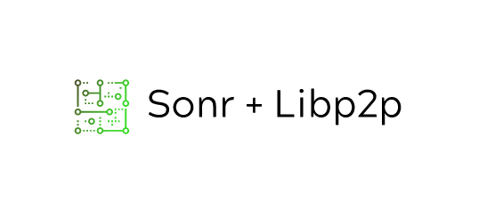

    
   

# Description
> Manages the Sonr Libp2p node in Go, Handles File Management, Connection to Peer, Pub-Sub for Lobby, and Graph Data Structure.

# Build
> Use `gomobile bind` command in `\bind\core\`

### Compatible types
- Signed integer and floating point types. 
- `int` `uint` `int16` `int32` `uint32` `int64` `uint64` `uintptr`

- String and boolean types. `bool` `string`

- Byte slice types. Note that byte slices are passed by reference,
  and support mutation. 
  - `byte // alias for uint8`  `rune // alias for int32, represents a Unicode code point`
  - `complex64` `complex128`

**Any function type all of whose parameters and results have
  supported types.** 
  Functions must return either no results,
  one result, or two results where the type of the second is
  the built-in 'error' type.

Any interface type, all of whose exported methods have
  supported function types.

Any struct type, all of whose exported methods have
  supported function types and all of whose exported fields
  have supported types.

# Resources
### GoMobile
- https://medium.com/@matryer/tutorial-calling-go-code-from-swift-on-ios-and-vice-versa-with-gomobile-7925620c17a4
- https://divan.dev/talks/2019/gdgbcn/FlutterGomobile.pdf

### Libp2p
- https://github.com/libp2p/go-libp2p-pubsub
- https://docs.libp2p.io/concepts/publish-subscribe/
- https://github.com/libp2p/go-libp2p-examples/tree/master/pubsub/chat
- https://github.com/libp2p/specs/blob/master/rendezvous/README.md
- https://github.com/ipfs/go-ipfs/blob/master/core/bootstrap/bootstrap.go
- **Complete Concept Reference**: https://simpleaswater.com/libp2p/

### File Management
- https://github.com/h2non/filetype 
