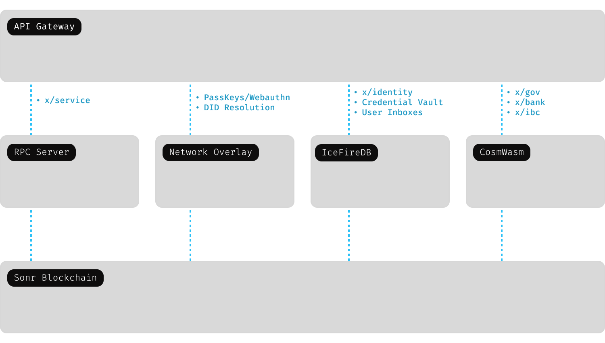

---

# `sonr-io/sonr`

Sonr is an ibc-enabled blockchain for decentralized identity.

- [x] Passkey based User Accounts. [__Docs__](https://sonr.io/docs/guides/database)
- [x] DKLS-MPC Powered Wallets _(No seed phrases)_. [__Docs__](https://sonr.io/docs/guides/auth)
- [x] IPFS Database and Storage. [__Docs__](https://sonr.io/docs/guides/storage)
  - [x] Redis. [__Docs__](https://sonr.io/docs/guides/api#rest-api-overview)
  - [x] MySQL. [__Docs__](https://sonr.io/docs/guides/api#graphql-api-overview)
  - [ ] User mailboxes. [Status](https://github.com/sonrhq/core/issues/781)
  - [ ] database subscriptions. [Status](https://github.com/sonrhq/core/issues/782)
  - [ ] Matrix chat. [Status](https://github.com/sonrhq/core/issues/783)
- [x] IBC Integrations.
  - [ ] Nomic. [Status](https://github.com/sonrhq/core/issues/784)
  - [ ] Evmos. [Status](https://github.com/sonrhq/core/issues/785)
  - [ ] Osmosis. [Status](https://github.com/sonrhq/core/issues/786)
- [x] Smart Contracts. [__Docs__](https://sonr.io/docs/guides/storage)
- [ ] Typescript Client SDKs. [Status](https://github.com/sonr-io/front/milestone/2)
- [ ] Dashboard. [Status](https://github.com/sonr-io/front/milestone/1)

## Documentation

For full documentation, visit [sonr.io/docs](https://sonr.io/docs)

To see how to Contribute, visit [Getting Started](./docs/contribution/DEVELOPERS.md)

## Community & Support

- [Forum](https://github.com/sonrhq/core/discussions)
- [Issues](https://github.com/sonrhq/core/issues)
- [Twitter](https://sonr.io/twitter)
- [Dev Chat](https://sonr.io/discord)

## Status

- [X] __Alpha__: Closed testing.
- [X] __Private Devnet__: May have kinks. [See projects](https://sonr.io/dashboard).
- [ ] __Public Testnet__: Stable for non-enterprise use. [Join it](https://sonr.io/dashboard).
- [ ] __Mainnet__: Coming soon. [Watch status](https://sonr.io/docs/guides/getting-started/features#feature-status).

We are currently in transitioning to Public Testnet. Watch [releases](https://github.com/sonrhq/core/releases) of this repo to get notified of major updates.

## How it works

Sonr is a combination of decentralized primitives. Fundamentally, it is a peer-to-peer identity and asset management system that leverages DID documents, Webauthn, and IPFS — providing users with a secure, portable decentralized identity.

Sonr is built on top of the Cosmos SDK, which is a framework for building blockchain applications in Golang. We use these modules:

- `x/auth`
- `x/bank`
- `x/distribution`
- `x/ibc`
- `x/ibc/applications/transfer`
- `x/gov`
- `x/params`
- `x/slashing`
- `x/staking`
- `x/upgrade`
- `x/wasm`

### Architecture

Sonr is a [blockchain node](https://sonr.io/dashboard) which you can run locally, or use to join our testnet. You can sign up and start using Sonr without installing anything using our [dashboard](https://sonr.io/dashboard).

See [additional details](https://sonr.io/docs) on these components.
<!--
### Client libraries

Our approach for client libraries is uniform. Abstract away any blockchain specific details, and provide a simple interface for developers to use. We have a few client libraries that we maintain, and provide [guidelines](./docs/contribution/CLIENT_GUIDELINES.md) for community maintained libraries.

<table style="table-layout:fixed; white-space: nowrap;">
  <tr>
    <th>Language</th>
    <th>Client</th>
    <th colspan="5">Feature-Clients (bundled in Sonr client)</th>
  </tr>
  <!-- notranslate -->
  <tr>
    <th></th>
    <th>Sonr</th>
    <th><a href="https://github.com/sonr-io/auth-js" target="_blank" rel="noopener noreferrer">Authentication</a></th>
    <th><a href="https://github.com/sonr-io/database-js" target="_blank" rel="noopener noreferrer">Database</a></th>
    <th><a href="https://github.com/sonr-io/storage-js" target="_blank" rel="noopener noreferrer">Storage</a></th>
    <th>wallet</th>
  </tr>
  <!-- TEMPLATE FOR NEW ROW -->
  <!-- START ROW
  <tr>
    <td>lang</td>
    <td><a href="https://github.com/sonr-community/sonr-lang" target="_blank" rel="noopener noreferrer">sonr-lang</a></td>
    <td><a href="https://github.com/sonr-community/auth-lang" target="_blank" rel="noopener noreferrer">auth-lang</a></td>
    <td><a href="https://github.com/sonr-community/database-lang" target="_blank" rel="noopener noreferrer">database-lang</a></td>
    <td><a href="https://github.com/sonr-community/storage-lang" target="_blank" rel="noopener noreferrer">storage-lang</a></td>
  </tr>
  END ROW -->
  <!-- /notranslate -->
  <th colspan="7">⚡️ Official ⚡️</th>
  <!-- notranslate -->
  <tr>
    <td>JavaScript (TypeScript)</td>
    <td><a href="https://github.com/sonrhq/core-js" target="_blank" rel="noopener noreferrer">sonr-js</a></td>
    <td><a href="https://github.com/sonr-io/auth-js" target="_blank" rel="noopener noreferrer">auth-js</a></td>
    <td><a href="https://github.com/sonr-io/database-js" target="_blank" rel="noopener noreferrer">database-js</a></td>
    <td><a href="https://github.com/sonr-io/storage-js" target="_blank" rel="noopener noreferrer">storage-js</a></td>
    <td><a href="https://github.com/sonr-io/wallet-js" target="_blank" rel="noopener noreferrer">wallet-js</a></td>
  </tr>
    <tr>
    <td>Flutter</td>
    <td><a href="https://github.com/sonrhq/core-flutter" target="_blank" rel="noopener noreferrer">sonr-flutter</a></td>
    <td><a href="https://github.com/sonr-io/auth-dart" target="_blank" rel="noopener noreferrer">auth-dart</a></td>
    <td><a href="https://github.com/sonr-io/database-dart" target="_blank" rel="noopener noreferrer">database-dart</a></td>
    <td><a href="https://github.com/sonr-io/storage-dart" target="_blank" rel="noopener noreferrer">storage-dart</a></td>
    <td><a href="https://github.com/sonr-io/wallet-dart" target="_blank" rel="noopener noreferrer">wallet-dart</a></td>
  </tr>
    <tr>
    <td>Go</td>
    <td>-</td>
    <td><a href="https://github.com/sonr-community/auth-go" target="_blank" rel="noopener noreferrer">auth-go</a></td>
    <td>-</td>
    <td><a href="https://github.com/sonr-community/storage-go" target="_blank" rel="noopener noreferrer">storage-go</a></td>
    <td><a href="https://github.com/sonr-community/wallet-go" target="_blank" rel="noopener noreferrer">wallet-go</a></td>
  </tr>
  <!-- /notranslate -->
  <th colspan="7">💚 Community 💚</th>
  <!-- notranslate -->
  <tr>
    <td>Java</td>
    <td>-</td>
    <td>-</td>
    <td>-</td>
    <td><a href="https://github.com/sonr-community/storage-java" target="_blank" rel="noopener noreferrer">storage-java</a></td>
    <td>-</td>
  </tr>
  <tr>
    <td>Swift</td>
    <td><a href="https://github.com/sonr-community/sonr-swift" target="_blank" rel="noopener noreferrer">sonr-swift</a></td>
    <td><a href="https://github.com/sonr-community/auth-swift" target="_blank" rel="noopener noreferrer">auth-swift</a></td>
    <td><a href="https://github.com/sonr-community/database-swift" target="_blank" rel="noopener noreferrer">database-swift</a></td>
    <td><a href="https://github.com/sonr-community/storage-swift" target="_blank" rel="noopener noreferrer">storage-swift</a></td>
    <td><a href="https://github.com/sonr-community/wallet-swift" target="_blank" rel="noopener noreferrer">wallet-swift</a></td>
  </tr>
    <tr>
    <td>C#</td>
    <td><a href="https://github.com/sonr-community/sonr-csharp" target="_blank" rel="noopener noreferrer">sonr-csharp</a></td>
    <td><a href="https://github.com/sonr-community/auth-csharp" target="_blank" rel="noopener noreferrer">auth-csharp</a></td>
    <td><a href="https://github.com/sonr-community/database-csharp" target="_blank" rel="noopener noreferrer">database-csharp</a></td>
    <td><a href="https://github.com/sonr-community/storage-csharp" target="_blank" rel="noopener noreferrer">storage-csharp</a></td>
    <td><a href="https://github.com/sonr-community/wallet-csharp" target="_blank" rel="noopener noreferrer">wallet-csharp</a></td>
  </tr>
  <!-- /notranslate -->
</table> -->

---

## Acknowledgements

Sonr would not have been possible without the direct and indirect support of the following organizations and individuals:

- __Protocol Labs__: For IPFS & Libp2p.
- __Interchain Foundation__: For Cosmos & IBC.
- __Tim Berners-Lee__: For the Internet.
- __Satoshi Nakamoto__: For Bitcoin.
- __Steve Jobs__: For Taste.

Thank you for your support and inspiration!
