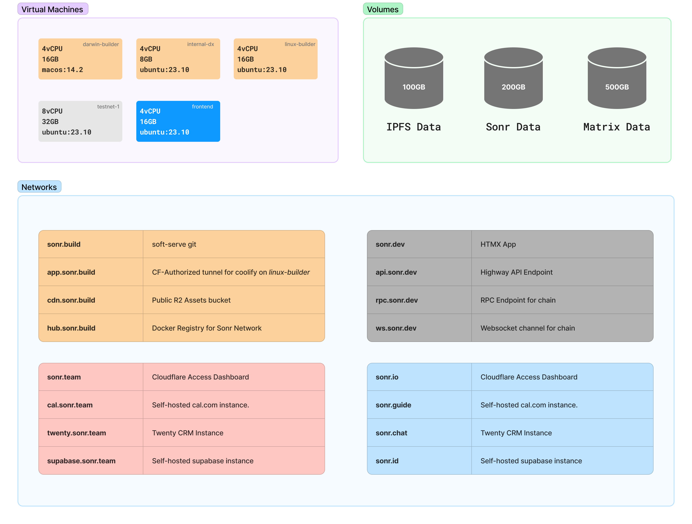

# Production Infrastructure

This repository contains Terraform code to deploy the entire Sonr infrastructure on AWS/GCP/Azure. This includes the following services:

- Sonr Website
- Sonr Network (Testnet, Devnet, Mainnet)
- Sonr Internal Services (API, Database, etc.)

## Prerequisites

- [Terraform](https://www.terraform.io/downloads.html)
- [Task](https://taskfile.dev/#/installation)

## Usage

The entire process is controlled via GitHub Actions with Worflow dispatch. Automated deployment is not enabled for security reasons. Local provisioning is possible using the provided `Taskfile.yml`.

## Architecture

## Contributing

Only authorized users can contribute to this repository. If you are an authorized user, please follow the [Contributing Guidelines](CONTRIBUTING.md).
