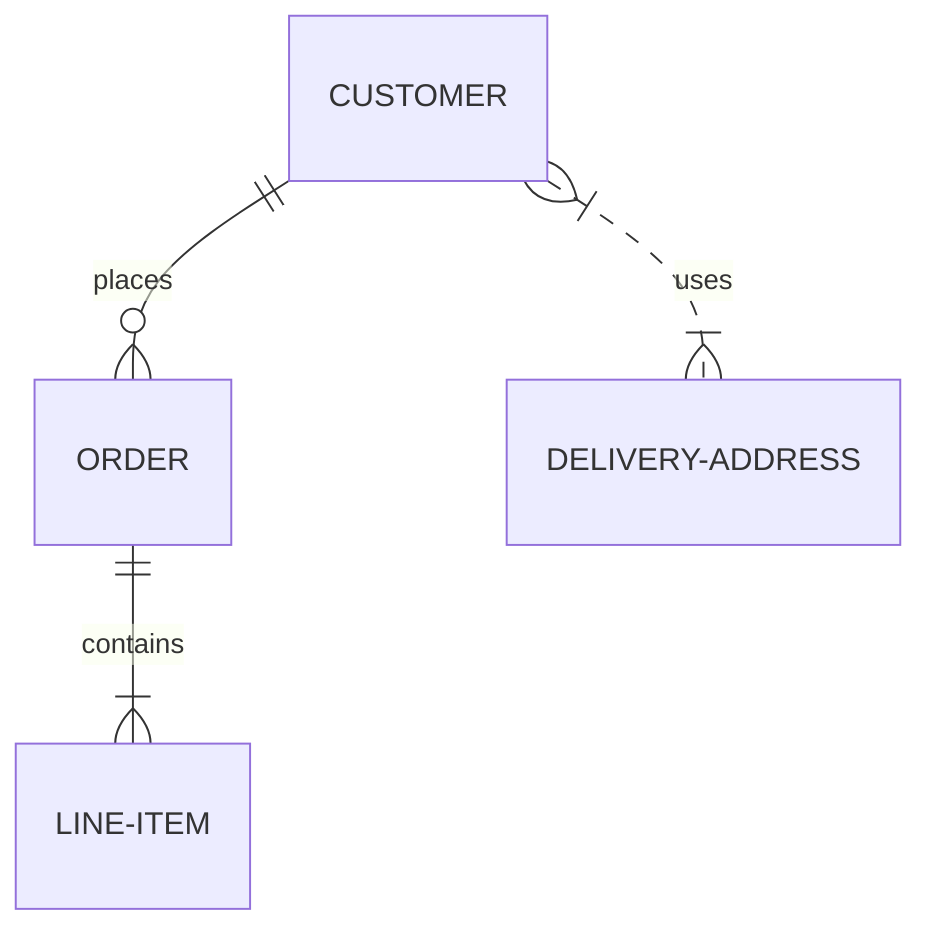

# Sonr DID Method Specification

## Table of Contents

{{TOC}}

## Abstract

Sonr is a privacy focused blockchain built to reinvent how we handle identity and data transmission. Sonr also supports DID operations. DIDs are created and stored in the Sonr Node, and they are used with verifiable credentials.

This specification describes how DIDs are managed on the Sonr.

## DID Method Name

The namestring is `sonr`.

A DID must begin with the prefix: `did:sonr` in lowercase.

## DID Method Specific Identifier

```text
sonr-did = "did:sonr:" idstring
idstring = 32*44(base58)
base58 = "1" / "2" / "3" / "4" / "5" / "6" / "7" / "8" / "9" / "A" / "B" /
         "C" / "D" / "E" / "F" / "G" / "H" / "J" / "K" / "L" / "M" / "N" /
         "P" / "Q" / "R" / "S" / "T" / "U" / "V" / "W" / "X" / "Y" / "Z" /
         "a" / "b" / "c" / "d" / "e" / "f" / "g" / "h" / "i" / "j" / "k" /
         "m" / "n" / "o" / "p" / "q" / "r" / "s" / "t" / "u" / "v" / "w" /
         "x" / "y" / "z"
```

The `idstring` is a base58-encoded SHA-256 hash of a Secp256k1 public key. It means that DIDs are case-sensitive, even though the prefix is always lower-case. The Sonr SDK provides a tool for generating the Secp256k1 key-pair either randomly or from a mnemonic provided by the user.

Example:

```text
did:sonr:7Prd74ry1Uct87nZqL3ny7aR7Cg46JamVbJgk8azVgUm
```

### Relationship between DIDs and Sonr accounts

DIDs are independent of any Sonr accounts. Sonr accounts are necessary only for sending transactions to Sonr to create/update/deactivate the DIDs.

It means that Sonr accounts are not used to verify the DID ownership. To prove the DID ownership, users must include a signature to the transaction. The signature must be generated with the private key which corresponds to one of the public keys registered in the DID document. The signature is different from the Sonr transaction signature generated with the private key of the Sonr account.

The details are described below.

## DID Document Format (JSON-LD)

```json
{
    "@context": "https://www.w3.org/ns/did/v1",
    "id": "did:sonr:7Prd74ry1Uct87nZqL3ny7aR7Cg46JamVbJgk8azVgUm",
    "verificationMethod": [
        {
            "id": "did:sonr:7Prd74ry1Uct87nZqL3ny7aR7Cg46JamVbJgk8azVgUm#key1",
            "type": "Secp256k1VerificationKey2018",
            "controller": "did:sonr:7Prd74ry1Uct87nZqL3ny7aR7Cg46JamVbJgk8azVgUm",
            "publicKeyBase58": "dBuN4i7dqwCLzSX7GHBLsfUoXw5RmWQ3DwQ9Ee4bfh5Y"
        }
    ],
    "authentication": [
        "did:sonr:7Prd74ry1Uct87nZqL3ny7aR7Cg46JamVbJgk8azVgUm#key1"
    ]
}
```

Currently, the `controller` in the `verificationMethod` must be equal to the [DID subject](https://www.w3.org/TR/2020/WD-did-core-20200907/#dfn-did-subjects). It would be extended later.

The Key IDs in the `authentication` are references to one of public keys specified in the `verificationMethod`. The spec of the `authentication` would be extended in the future.

The Sonr DID Document doesn't contain the `service` field currently. It would be extended soon.

## CRUD Operations

### Create (Register)

To create a DID Document in Sonr, the following transaction should be submitted.

```json
{
    "type": "did/MsgCreateDID",
    "value": {
        "did": "did:sonr:7Prd74ry1Uct87nZqL3ny7aR7Cg46JamVbJgk8azVgUm",
        "document": {
            "@context": "https://www.w3.org/ns/did/v1",
            "id": "did:sonr:7Prd74ry1Uct87nZqL3ny7aR7Cg46JamVbJgk8azVgUm",
            "verificationMethod": [
                {
                    "id": "did:sonr:7Prd74ry1Uct87nZqL3ny7aR7Cg46JamVbJgk8azVgUm#key1",
                    "type": "Secp256k1VerificationKey2018",
                    "controller": "did:sonr:7Prd74ry1Uct87nZqL3ny7aR7Cg46JamVbJgk8azVgUm",
                    "publicKeyBase58": "dBuN4i7dqwCLzSX7GHBLsfUoXw5RmWQ3DwQ9Ee4bfh5Y"
                }
            ],
            "authentication": [
                "did:sonr:7Prd74ry1Uct87nZqL3ny7aR7Cg46JamVbJgk8azVgUm#key1"
            ]
        },
        "signature": "FLOgUBcMEjKs/o1lgu4Y5Ump/2xee0D0tLsrY9+YVMUD/G/qbSHo3lOJ4Jv2zsDn1grcbIYSQsOvoBTbYXXg3g==",
        "verification_method_id": "did:sonr:7Prd74ry1Uct87nZqL3ny7aR7Cg46JamVbJgk8azVgUm#key1",
        "from_address": "sonr1d58s72gu0mjkw0lkgyvr0eqzz3mv74awfsjslz"
    }
}
```

The transaction must have a `did` and a `document` which will be stored in the Sonr blockchain.

It also must have a `signature` and a `verification_method_id` for proving the ownership of the DID.
The `signature` must be generated from the `document` and the sequence `"0"`.
It must be signed with a private key which corresponds to the public key referred by the `verification_method_id`.
The `verification_method_id` must be one of the key IDs specified in the `authentication` of the `document`.

The source of the `signature` should look like (encoded with Amino):

```json
{
    "data": {
        "@context": ...,
        "id": "did:sonr:...",
        ...
    },
    "sequence": "0"
}
```

The transaction also must contain a `from_address` which is a Sonr account.
Also, it must be signed with the private key of the Sonr account, so that Sonr can verify the transaction.

The transaction fails if the same DID exists or if it has been already deactivated.

### Read

A Sonr DID Document can be looked up by the following query.

```json
{
    "did": "did:sonr:7Prd74ry1Uct87nZqL3ny7aR7Cg46JamVbJgk8azVgUm"
}
```

If the DID exists (not deactivated yet), the result is:

```json
{
    "document": {
        "@context": "https://www.w3.org/ns/did/v1",
        "id": "did:sonr:7Prd74ry1Uct87nZqL3ny7aR7Cg46JamVbJgk8azVgUm",
        "verificationMethod": [
            {
                "id": "did:sonr:7Prd74ry1Uct87nZqL3ny7aR7Cg46JamVbJgk8azVgUm#key1",
                "type": "Secp256k1VerificationKey2018",
                "controller": "did:sonr:7Prd74ry1Uct87nZqL3ny7aR7Cg46JamVbJgk8azVgUm",
                "publicKeyBase58": "dBuN4i7dqwCLzSX7GHBLsfUoXw5RmWQ3DwQ9Ee4bfh5Y"
            }
        ],
        "authentication": [
            "did:sonr:7Prd74ry1Uct87nZqL3ny7aR7Cg46JamVbJgk8azVgUm#key1"
        ]
    },
    "sequence": "0"
}
```

The `sequence` is returned along with the `document`.
It must be included in the subsequent transaction (update/deactivate) for preventing transaction replay attacks.

### Update

Only the DID owner can replace the DID Document using the following transaction.

This example is for adding a new public key to the `verificationMethod` and adding a dedicated public key to the `authentication`.

```json
{
    "type": "did/MsgUpdateDID",
    "value": {
        "did": "did:sonr:7Prd74ry1Uct87nZqL3ny7aR7Cg46JamVbJgk8azVgUm",
        "document": {
            "@context": "https://www.w3.org/ns/did/v1",
            "id": "did:sonr:7Prd74ry1Uct87nZqL3ny7aR7Cg46JamVbJgk8azVgUm",
            "verificationMethod": [
                {
                    "id": "did:sonr:7Prd74ry1Uct87nZqL3ny7aR7Cg46JamVbJgk8azVgUm#key1",
                    "type": "Secp256k1VerificationKey2018",
                    "controller": "did:sonr:7Prd74ry1Uct87nZqL3ny7aR7Cg46JamVbJgk8azVgUm",
                    "publicKeyBase58": "dBuN4i7dqwCLzSX7GHBLsfUoXw5RmWQ3DwQ9Ee4bfh5Y"
                },
                {
                    "id": "did:sonr:7Prd74ry1Uct87nZqL3ny7aR7Cg46JamVbJgk8azVgUm#key2",
                    "type": "Secp256k1VerificationKey2018",
                    "controller": "did:sonr:7Prd74ry1Uct87nZqL3ny7aR7Cg46JamVbJgk8azVgUm",
                    "publicKeyBase58": "2BjcxuwijyE1om4991ANiFrwZJ3Ev5YYX9KiPKgaHmGsi"
                }
            ],
            "authentication": [
                "did:sonr:7Prd74ry1Uct87nZqL3ny7aR7Cg46JamVbJgk8azVgUm#key1",
                {
                    "id": "did:sonr:7Prd74ry1Uct87nZqL3ny7aR7Cg46JamVbJgk8azVgUm#key3",
                    "type": "Secp256k1VerificationKey2018",
                    "controller": "did:sonr:7Prd74ry1Uct87nZqL3ny7aR7Cg46JamVbJgk8azVgUm",
                    "publicKeyBase58": "yE1om4991ANiFrwZJ3Ev5YYX9KiPKgaHmGsi2Bjcxuwij"
                }
            ]
        },
        "signature": "xtsQH3D5naHe9IXmhCnohlChwHiD0dx9PI4aPkaJPGoEznYMHmg0aBerg85ai7T2WNxxlc39uFzAxKbI4sbJCA==",
        "verification_method_id": "did:sonr:7Prd74ry1Uct87nZqL3ny7aR7Cg46JamVbJgk8azVgUm#key1",
        "from_address": "sonr1d58s72gu0mjkw0lkgyvr0eqzz3mv74awfsjslz"
    }
}
```

Like creating DIDs, The `signature` must be generated from the `document` and the `sequence` returned from the Read DID operation.
It must be signed with a private key which corresponds to the public key referred by the `verification_method_id`.
The `verification_method_id` must be one of the key IDs specified in the `authentication` of the `document`.

Whenever submitting this transaction, the user must query the current `sequence` by the Read DID operation.
(The user can also increment the `sequence` manually, but the transaction can be rejected if there are the concurrent transactions with the same `sequence`.)

The source of the `signature` should look like (encoded with Amino):

```json
{
    "data": {
        "@context": ...,
        "id": "did:sonr:...",
        ...
    },
    "sequence": "50"
}
```

The transaction fails if the DID has been already deactivated.

### Deactivate

To deactivate the DID document, the DID owner should send the following transaction.

Sonr doesn't delete the DID document. The document is just deactivated.
This strategy guarantees that malicious users cannot recreate the DID,
because the DID deactivation may be appropriate when a person dies or a business is terminated.

```json
{
    "type": "did/MsgDeactivateDID",
    "value": {
        "did": "did:sonr:7Prd74ry1Uct87nZqL3ny7aR7Cg46JamVbJgk8azVgUm",
        "signature": "xtsQH3D5naHe9IXmhCnohlChwHiD0dx9PI4aPkaJPGoEznYMHmg0aBerg85ai7T2WNxxlc39uFzAxKbI4sbJCA==",
        "verification_method_id": "did:sonr:7Prd74ry1Uct87nZqL3ny7aR7Cg46JamVbJgk8azVgUm#key1",
        "from_address": "sonr1d58s72gu0mjkw0lkgyvr0eqzz3mv74awfsjslz"
    }
}
```

The `signature` must be generated from the `did` and the `sequence` returned from the Read DID operation.
It must be signed with a private key which corresponds to the public key referred by the `verification_method_id`.
The `verification_method_id` must be one of the key IDs specified in the `authentication` of the `document`.

The source of the `signature` should look like (encoded with Amino):

```json
{
    "data": "did:sonr:...",
    "sequence": "50"
}
```

The transaction fails if the DID doesn't exist or if it has been already deactivated.

## Sequence Diagrams



## Security Considerations

_This section is non-normative._

### Replay Attack

To prove the DID ownership, Create/Update/Deactivate transactions must contain a `signature` and a `verification_method_id`.
If malicious users can replay the transaction with the same `signature`, the DID document can be modified unexpectedly.

To prevent replay attacks, a `sequence` must be included when generating the `signature`.
The `sequence` can be obtained by the Read DID operation.

The `sequence` is monotonically incremented by the Sonr when the transaction is committed.
That is, malicious users cannot reuse the signature from the previous transaction committed.
The user must generate a new signature from the new `sequence`.

## Privacy Considerations

_This section is non-normative._

### Keep Personally Identifiable Information (PII) Private

A DID Document should not include Personally Identifiable Information (PII), even if it is encrypted. All personal data should be kept behind service endpoints under the control of the DID subject. For example, if a DID Document contains a URL which contains any human-meaningful information, such as a username, some personal data can be unintentionally revealed without the DID subject's consent. For more details, please see the [Decentralized Identifier Specification](https://www.w3.org/TR/did-core/#keep-personally-identifiable-information-pii-private).

### DID Correlation Risks and Pseudonymous DIDs

If DID Controllers want to mitigate the risk of correlation, they should use unique DIDs for every interaction and the corresponding DID Documents should contain a unique public key. For more details, please see the [Decentralized Identifier Specification](https://www.w3.org/TR/did-core/#did-correlation-risks-and-pseudonymous-dids).

## Reference Implementations

- [Sonr Blockchain](https://github.com/sonr-io/sonr)
- [Sonr DID](https://github.com/sonr-io/did)

## References

- <https://w3c-ccg.github.io/did-spec/>
