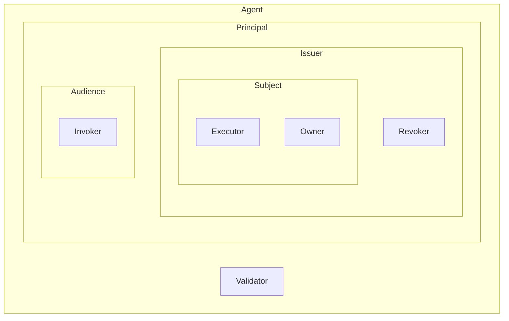
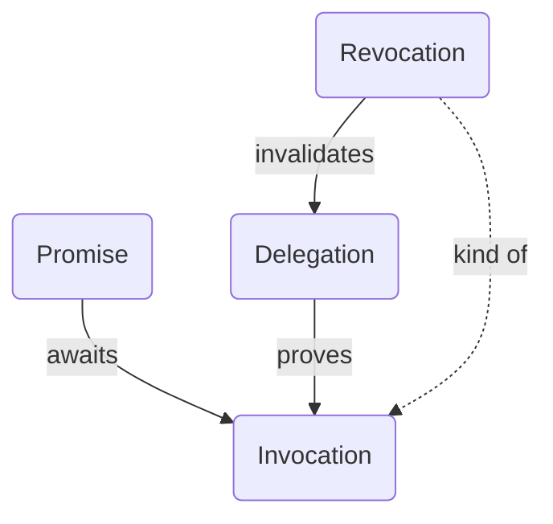
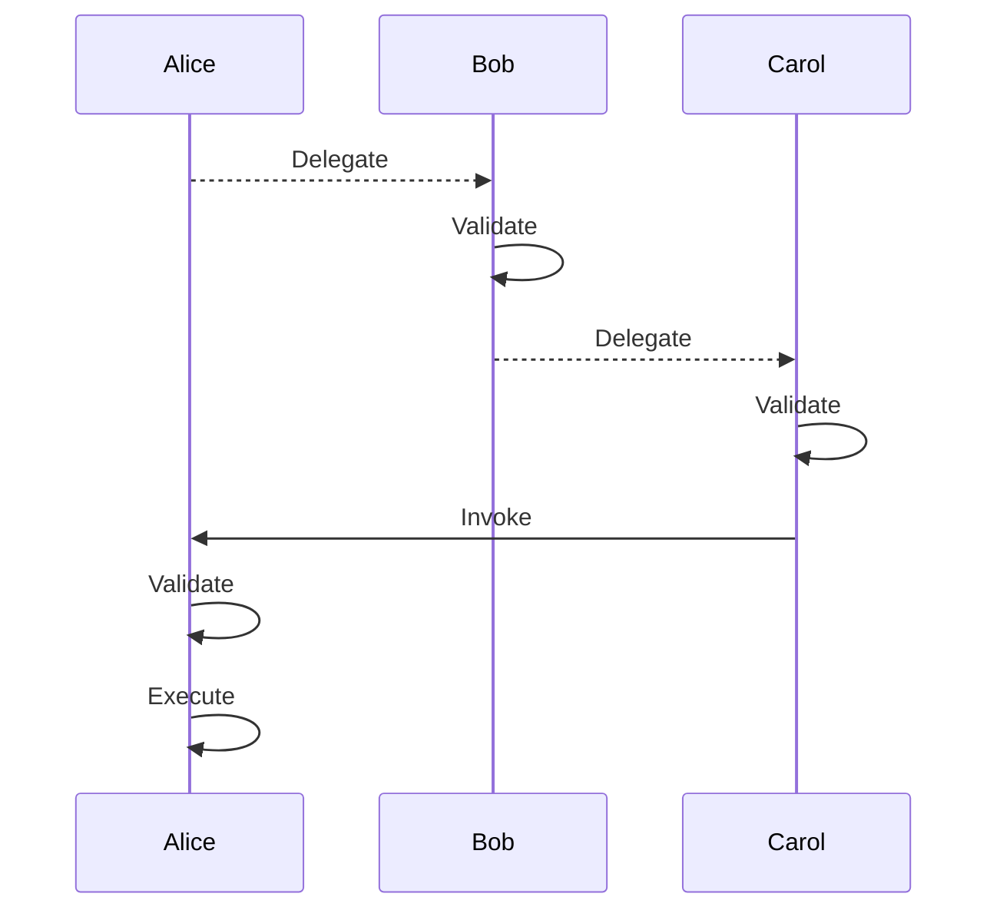
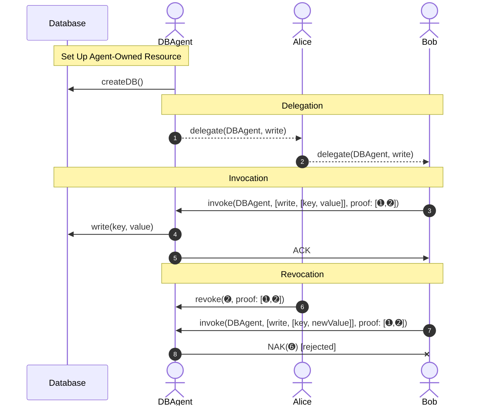
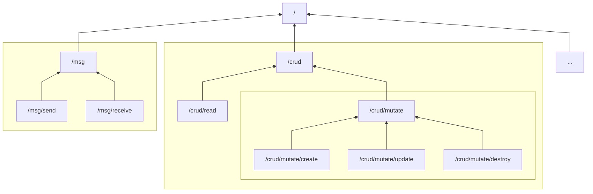
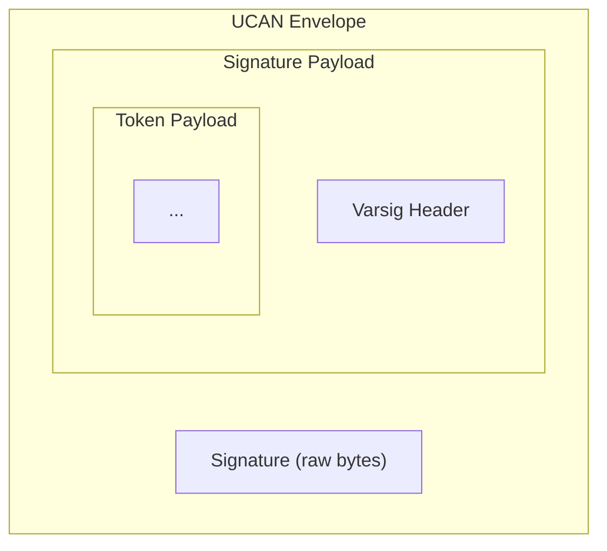
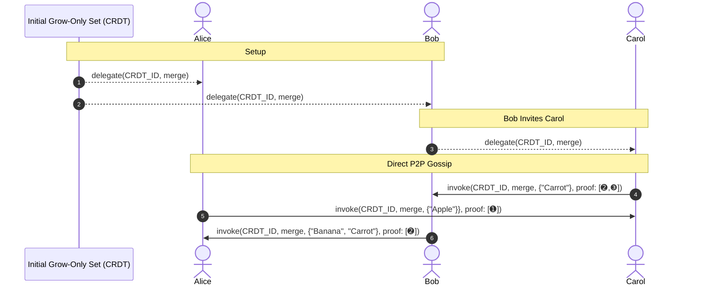
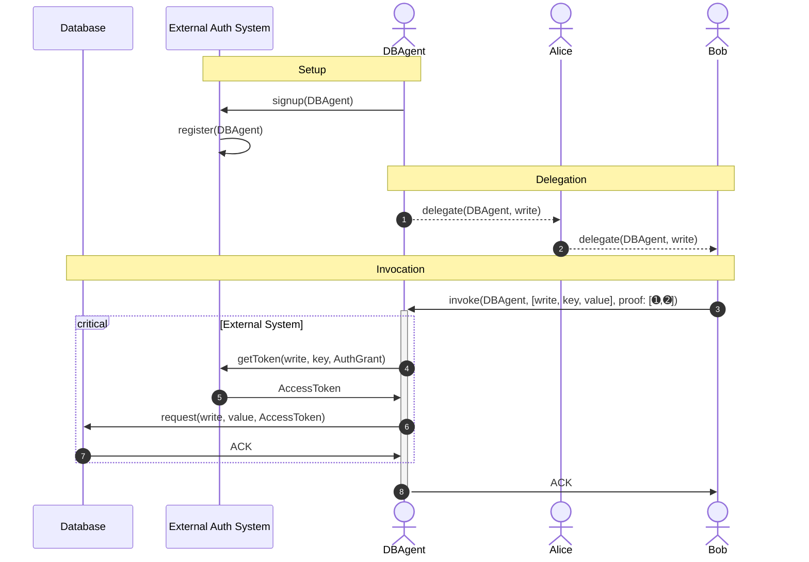

# User Controlled Authorization Network (UCAN) Specification

# Abstract

User-Controlled Authorization Network (UCAN) is a [trustless], secure, [local-first], user-originated, distributed authorization scheme. This document provides a high level overview of the components of the system, concepts, and motivation. Exact formats are given in [sub-specifications].

# Introduction

User-Controlled Authorization Network (UCAN) is a [trustless], secure, [local-first], user-originated, distributed authorization scheme. It provides public-key verifiable, delegable, expressive, openly extensible [capabilities]. UCANs achieve public verifiability with late-bound certificate chains and principals represented by [decentralized identifiers (DIDs)][DID].

UCAN improves the familiarity and adoptability of schemes like [SPKI/SDSI][SPKI] for web and native application contexts. UCAN allows for the creation, delegation, and invocation of authority by any agent with a DID, including traditional systems and peer-to-peer architectures beyond traditional cloud computing.

## Motivation

> If we practice our principles, we could have both security and functionality. Treating security as a separate concern has not succeeded in bridging the gap between principle and practice, because it operates without knowledge of what constitutes least authority.
>
> — [Miller][Mark Miller] et al, [The Structure of Authority]

Since at least [Multics], access control lists ([ACL]s) have been the most popular form of digital authorization, where a list of what each user is allowed to do is maintained on the resource. ACLs (and later [RBAC]) have been a successful model suited to architectures where persistent access to a single list is viable. ACLs require that rules are sufficiently well specified, such as in a centralized database with rules covering all possible permutations of scenario. This both imposes a very high maintenance burden on programmers as a systems grows in complexity, and is a key vector for [confused deputies][confused deputy problem].

With increasing interconnectivity between machines becoming commonplace, authorization needs to scale to meet the load demands of distributed systems while providing partition tolerance. However, it is not always practical to maintain a single central authorization source. Even when copies of the authorization list are distributed to the relevant servers, latency and partitions introduce troublesome challenges with conflicting updates, to say nothing of storage requirements.

A large portion of personal information now also moves through connected systems. As a result, data privacy is a prominent theme when considering the design of modern applications, to the point of being legislated in parts of the world.

Ahead-of-time coordination is often a barrier to development in many projects. Flexibility to define specialized authorization semantics for resources and the ability to integrate with external systems trustlessly are essential as the number of autonomous, specialized, and coordinated applications increases.

Many high-value applications run in hostile environments. In recognition of this, many vendors now include public key functionality, such as [non-extractable keys in browsers][browser api crypto key], [certificate systems for external keys][fido], [platform keys][passkey], and [secure hardware enclaves] in widespread consumer devices.

Two related models that work exceptionally well in the above context are Simple Public Key Infrastructure ([SPKI][spki rfc]) and object capabilities ([OCAP]). Since offline operation and self-verifiability are two requirements, UCAN adopts a [certificate capability model] related to [SPKI].

## Intuition for Auth System Differences

The following analogies illustrate several significant trade-offs between these systems but are only accurate enough to build intuition. A good resource for a more thorough presentation of these trade-offs is [Capability Myths Demolished]. In this framework, UCAN approximates SPKI with some dynamic features.

### Access Control Lists

By analogy, ACLs are like a bouncer at an exclusive event. This bouncer has a list attendees allowed in and which of those are VIPs that get extra access. People trying to get in show their government-issued ID and are accepted or rejected. In addition, they may get a lanyard to identify that they have previously been allowed in. If someone is disruptive, they can simply be crossed off the list and denied further entry.

If there are many such events at many venues, the organizers need to coordinate ahead of time, denials need to be synchronized, and attendees need to show their ID cards to many bouncers. The likelihood of the bouncer letting in the wrong person due to synchronization lag or confusion by someone sharing a name is nonzero.

### Certificate Capabilities

UCANs work more like [movie tickets][caps as keys] or a festival pass. No one needs to check your ID; who you are is irrelevant. For example, if you have a ticket issued by the theater to see Citizen Kane, you are admitted to Theater 3. If you cannot attend an event, you can hand this ticket to a friend who wants to see the film instead, and there is no coordination required with the theater ahead of time. However, if the theater needs to cancel tickets for some reason, they need a way of uniquely identifying them and sharing this information between them.

### Object Capabilities

Object capability ("ocap") systems use a combination of references, encapsulated state, and proxy forwarding. As the name implies, this is fairly close to object-oriented or actor-based systems. Object capabilities are [robust][Robust Composition], flexible, and expressive.

To achieve these properties, object capabilities have two requirements: [fail-safe], and locality preservation. The emphasis on consistency rules out partition tolerance[^pcec].

## Security Considerations

Each UCAN includes an assertions of what it is allowed to do. "Proofs" are positive evidence (elsewhere called "witnesses") of the possession of rights. They are cryptographically verifiable chains showing that the UCAN issuer either claims to directly own a resource, or that it was delegated to them by some claimed owner. In the most common case, the root owner's ID is the only globally unique identity for the resource.

Root capability issuers function as verifiable, distributed roots of trust. The delegation chain is by definition a provenance log. Private keys themselves SHOULD NOT move from one context to another. Keeping keys unique to each physical device and unique per use case is RECOMMENDED to reduce opportunity for keys to leak, and limit blast radius in the case of compromises. "Sharing authority without sharing keys" is provided by capabilities, so there is no reason to share keys directly.

Note that a structurally and cryptographically valid UCAN chain can be semantically invalid. The executor MUST verify the ownership of any external resources at execution time. While not possible for all use cases (e.g. replicated state machines and eventually consistent data), having the Executor be the resource itself is RECOMMENDED.

While certificate chains go a long way toward improving security, they do not provide [confinement] on their own. The principle of least authority SHOULD be used when delegating a UCAN: minimizing the amount of time that a UCAN is valid for and reducing authority to the bare minimum required for the delegate to complete their task. This delegate should be trusted as little as is practical since they can further sub-delegate their authority to others without alerting their delegator. UCANs do not offer confinement (as that would require all processes to be online), so it is impossible to guarantee knowledge of all of the sub-delegations that exist. The ability to revoke some or all downstream UCANs exists as a last resort.

## Inversion of Control

[Inversion of control] is achieved due to two properties: self-certifying delegation and reference passing. There is no Authorization Server (AS) that sits between requestors and resources. In traditional terms, the owner of a UCAN resource is the resource server (RS) directly.

This inverts the usual relationship between resources and users: the resource grants some (or all) authority over itself to agents, as opposed to an Authorization Server managing the relationship between them. This has several major advantages:

- Fully distributed and scalable
- Self-contained request without intermediary
- Partition tolerance, [support for replicated data and machines][overcoming SSI]
- Flexible granularity
- Compositionality: no distinction between resources residing together or apart

```
┌─────────────┐   ┌─────────────┐   ┌─────────────┐
│             │   │             │   │             │
│             │   │ ┌─────────┐ │   │             │
│             │   │ │  Bob's  │ │   │             │
│             │   │ │  Photo  │ │   │             │
│             │   │ │ Gallery │ │   │             │
│             │   │ └─────────┘ │   │             │
│             │   │             │   │             │
│   Alice's   │   │    Bob's    │   │   Carol's   │
│    Stuff    │   │    Stuff    │   │    Stuff    │
│             │   │             │   │             │
│     ┌───────┼───┼─────────────┼───┼──┐          │
│     │       │   │             │   │  │          │
│     │       │   │         ┌───┼───┼──┼────────┐ │
│     │       │   │ Alice's │   │   │  │        │ │
│     │       │   │  Music  │   │   │  │Carol's │ │
│     │       │   │ Player  │   │   │  │  Game  │ │
│     │       │   │         │   │   │  │        │ │
│     │       │   │         └───┼───┼──┼────────┘ │
│     │       │   │             │   │  │          │
│     └───────┼───┼─────────────┼───┼──┘          │
│             │   │             │   │             │
└─────────────┘   └─────────────┘   └─────────────┘
```

This additionally allows UCAN to model auth for [eventually consistent and replicated state][overcoming SSI].

# Roles

There are several roles that an agent MAY assume:

| Name      | Description                                                                                      |
| --------- | ------------------------------------------------------------------------------------------------ |
| Agent     | The general class of entities and principals that interact with a UCAN                           |
| Audience  | The Principal delegated to in the current UCAN. Listed in the `aud` field                        |
| Executor  | The Agent that actually performs the action described in an invocation                           |
| Invoker   | A Principal that requests an Executor perform some action that uses the Invoker's authority      |
| Issuer    | The Principal of the current UCAN. Listed in the `iss` field                                     |
| Owner     | A Subject that controls some external resource                                                   |
| Principal | An agent identified by DID (listed in a UCAN's `iss` or `aud` field)                             |
| Revoker   | The Issuer listed in a proof chain that revokes a UCAN                                           |
| Subject   | The Principal who's authority is delegated or invoked                                            |
| Validator | Any Agent that interprets a UCAN to determine that it is valid, and which capabilities it grants |



## Subject

> At the very least every object should have a URL
>
> — [Alan Kay], [The computer revolution hasn't happened yet]

> Every Erlang process in the universe should be addressable and introspective
>
> — [Joe Armstrong], [Code Mesh 2016]

A [Subject] represents the Agent that a capability is for. A Subject MUST be referenced by [DID]. This behaves much like a [GUID], with the addition of public key verifiability. This unforgeability prevents malicious namespace collisions which can lead to [confused deputies][confused deputy problem].

### Resource

A resource is some data or process that can be uniquely identified by a [URI]. It can be anything from a row in a database, a user account, storage quota, email address, etc. Resource MAY be as coarse or fine grained as desired. Finer-grained is RECOMMENDED where possible, as it is easier to model the principle of least authority ([PoLA]).

A resource describes the noun of a capability. The resource pointer MUST be provided in [URI] format. Arbitrary and custom URIs MAY be used, provided that the intended recipient can decode the URI. The URI is merely a unique identifier to describe the pointer to — and within — a resource.

Having a unique agent represent a resource (and act as its manager) is RECOMMENDED. However, to help traditional ACL-based systems transition to certificate capabilities, an agent MAY manage multiple resources, and [act as the registrant in the ACL system][wrapping existing systems].

Unless explicitly stated, the Resource of a UCAN MUST be the Subject.

## Issuer & Audience

The Issuer (`iss`) and Audience (`aud`) can be conceptualized as the sender and receiver (respectively) of a postal letter. Every UCAN MUST be signed with the private key associated with the DID in the `iss` field.

For example:

```js
"aud": "did:key:z6MkiTBz1ymuepAQ4HEHYSF1H8quG5GLVVQR3djdX3mDooWp",
"iss": "did:key:zDnaerDaTF5BXEavCrfRZEk316dpbLsfPDZ3WJ5hRTPFU2169",
```

Please see the [Cryptosuite] section for more detail on DIDs.

# Lifecycle

The UCAN lifecycle has four components:

| Spec         | Description                                                              | Requirement Level |
| ------------ | ------------------------------------------------------------------------ | ----------------- |
| [Delegation] | Pass, attenuate, and secure authority in a partition-tolerant way        | REQUIRED          |
| [Invocation] | Exercise authority that has been delegated through one or more delegates | REQUIRED          |
| [Promise]    | Await the result of an Invocation inside another Invocation              | RECOMMENDED       |
| [Revocation] | Undo a delegation, breaking a delegation chain for malicious users       | RECOMMENDED       |



## Time

It is often useful to talk about a UCAN in the context of some action. For example, a UCAN delegation may be valid when it was created, but expired when invoked.



### Validity Interval

The period of time that a capability is valid from and until. This is the range from the latest "not before" to the earliest expiry in the UCAN delegation chain.

### Delegation-Time

The moment at which a delegation is asserted. This MAY be captured by an `iat` field, but is generally superfluous to capture in the token.

### Invocation-Time

The moment a UCAN Invocation is created. It must be within the Validity Interval.

### Validation-Time

Validation MAY occur at multiple points during a UCAN's lifecycle. The main two are:

- On receipt of a delegation
- When executing an invocation

### Execution-Time

To avoid the overloaded word "runtime", UCAN adopts the term "execution-time" to express the moment that the executor attempts to use the authority captured in an invocation and associated delegation chain. Validation MUST occur at this time.

## Time Bounds

`nbf` and `exp` stand for "not before" and "expires at," respectively. These MUST be expressed as seconds since the Unix epoch in UTC, without time zone or other offset. Taken together, they represent the time bounds for a token. These timestamps MUST be represented as the number of integer seconds since the Unix epoch. Due to limitations[^js-num-size] in numerics for certain common languages, timestamps outside of the range from $-2^{53} – 1$ to $2^{53} – 1$ MUST be rejected as invalid.

The `nbf` field is OPTIONAL. When omitted, the token MUST be treated as valid beginning from the Unix epoch. Setting the `nbf` field to a time in the future MUST delay invoking a UCAN. For example, pre-provisioning access to conference materials ahead of time but not allowing access until the day it starts is achievable with judicious use of `nbf`.

The `exp` field is RECOMMENDED. Following the [principle of least authority][PoLA], it is RECOMMENDED to give a timestamp expiry for UCANs. If the token explicitly never expires, the `exp` field MUST be set to `null`. If the time is in the past at validation time, the token MUST be treated as expired and invalid.

Keeping the window of validity as short as possible is RECOMMENDED. Limiting the time range can mitigate the risk of a malicious user abusing a UCAN. However, this is situationally dependent. It may be desirable to limit the frequency of forced reauthorizations for trusted devices. Due to clock drift, time bounds SHOULD NOT be considered exact. A buffer of ±60 seconds is RECOMMENDED.

Several named points of time in the UCAN lifecycle can be found in the [high level spec][UCAN].

Below are a couple examples:

```js
{
  // ...
  "nbf": 1529496683,
  "exp": 1575606941
}
```

```js
{
  // ...
  "exp": 1575606941
}
```

```js
{
  // ...
  "nbf": 1529496683,
  "exp": null
}
```

## Lifecycle Example

Here is a concrete example of all stages of the UCAN lifecycle for database write access.



## Capability

A capability is the association of an ability to a subject: `subject x command x policy`.

The Subject and Command fields are REQUIRED. Any non-normative extensions are OPTIONAL.

For example, a capability may used to represent the ability to send email from a certain address to others at `@example.com`.

| Field   | Example                                                                                      |
| ------- | -------------------------------------------------------------------------------------------- |
| Subject | `did:key:z6MkhaXgBZDvotDkL5257faiztiGiC2QtKLGpbnnEGta2doK`                                   |
| Command | `/msg/send`                                                                                  |
| Policy  | `["or", ["==", ".from", "mailto:me@example.com"], ["match", ".cc", "mailto:*@example.com"]]` |

For a more complete treatment, please see the [UCAN Delegation][delegation] spec.

## Authority

> Whether to enable cooperation or to limit vulnerability, we care about _authority_ rather than _permissions._ Permissions determine what actions an individual program may perform on objects it can directly access. Authority describes the effects that a program may cause on objects it can access, either directly by permission, or indirectly by permitted interactions with other programs.
>
> —[Mark Miller], [Robust Composition]

The set of capabilities delegated by a UCAN is called its "authority." To frame it another way, it's the set of effects that a principal can cause, and acts as a declarative description of delegated abilities.

Merging capability authorities MUST follow set semantics, where the result includes all capabilities from the input authorities. Since broader capabilities automatically include narrower ones, this process is always additive. Capability authorities can be combined in any order, with the result always being at least as broad as each of the original authorities.

```plaintext
                   ┌───────────────────────┐  ┐
                   │                       │  │
                   │                       │  │
                   │                       │  │
                   │                       │  │
                   │       Subject B       │  │
┌──────────────────┼ ─ ─       x           │  │
│                       │  Ability Z       │  ├──    BxZ
│                  │                       │  │  Capability
│                       │                  │  │
│                  │                       │  │
│       Subject A       │                  │  │
│           x      │                       │  │
│       Ability Y   ─  ─┼──────────────────┘  ┘
│                       │
│                       │
│                       │
│                       │
│                       │
└───────────────────────┘

└─────────────────────┬────────────────────┘
                      │
                  AxY U BxZ
                  Capability
```

The capability authority is the total rights of the authorization space down to the relevant volume of authorizations. Individual capabilities MAY overlap; the authority is the union. Every unique delegated capability MUST have equal or narrower capabilities from their delegator. Inside this content space, you can draw a boundary around some resource(s) (their type, identifiers, and paths or children) and their capabilities.

## Command

Commands are concrete messages ("verbs") that MUST be unambiguously interpretable by the Subject of a UCAN. Commands are REQUIRED in invocations. Some examples include `/msg/send`, `/crud/read`, and `/ucan/revoke`.

Much like other message-passing systems, the specific resource MUST define the behavior for a particular message. For instance, `/crud/update` MAY be used to destructively update a database row, or append to a append-only log. Specific messages MAY be created at will; the only restriction is that the Executor understand how to interpret that message in the context of a specific resource.

While arbitrary semantics MAY be described, they MUST apply to the target resource. For instance, it does not make sense to apply `/msg/send` to a typical file system.

### Segment Structure

Commands MUST be lowercase, and begin with a slash (`/`). Segments MUST be separated by a slash. A trailing slash MUST NOT be present. All of the following are syntactically valid Commands:

- `/`
- `/crud`
- `/crud/create`
- `/stack/pop`
- `/crypto/sign`
- `/foo/bar/baz/qux/quux`
- `/ほげ/ふが`

Segment structure is important since shorter Commands prove longer paths. For example, `/` can be used as a proof of _any_ other Command. For example, `/crypto` MAY be used to prove `/crypto/sign` but MUST NOT prove `/stack/pop` or `/cryptocurrency`.

### `/` AKA "Top"

_"Top" (`/`) is the most powerful ability, and as such it SHOULD be handled with care and used sparingly._

The "top" (or "any", or "wildcard") ability MUST be denoted `/`. This can be thought of as something akin to a super user permission in RBAC.

The wildcard ability grants access to all other capabilities for the specified resource, across all possible namespaces. The wildcard ability is useful when "linking" agents by delegating all access to another device controlled by the same user, and that should behave as the same agent. It is extremely powerful, and should be used with care. Among other things, it permits the delegate to update a Subject's mutable DID document (change their private keys), revoke UCAN delegations, and use any resources delegated to the Subject by others.



### Reserved Commands

#### `/ucan` Namespace

The `/ucan` Command namespace MUST be reserved. This MUST include any ability string matching the regex `^ucan\/.*`. This is important for keeping a space for community-blessed Commands in the future, such as standard library Commands, such as [Revocation].

## Attenuation

Attenuation is the process of constraining the capabilities in a delegation chain. Each direct delegation MUST either directly restate or attenuate (diminish) its capabilities.

# Token Resolution

Token resolution is transport specific. The exact format is left to the relevant UCAN transport specification. At minimum, such a specification MUST define at least the following:

1. Request protocol
2. Response protocol
3. Collections format

Note that if an instance cannot dereference a CID at runtime, the UCAN MUST fail validation. This is consistent with the [constructive semantics] of UCAN.

# Nonce

The REQUIRED nonce parameter `nonce` MAY be any value. A randomly generated string is RECOMMENDED to provide a unique UCAN, though it MAY also be a monotonically increasing count of the number of links in the hash chain. This field helps prevent replay attacks and ensures a unique CID per delegation. The `iss`, `aud`, and `exp` fields together will often ensure that UCANs are unique, but adding the nonce ensures uniqueness.

The recommended size of the nonce differs by key type. In many cases, a random 12-byte nonce is sufficient. If uncertain, check the nonce in your DID's crypto suite.

This field SHOULD NOT be used to sign arbitrary data, such as signature challenges. See the [`meta`][Metadata] field for more.

Here is a simple example.

```js
{
  // ...
  "nonce": {"/": {"bytes": "bGlnaHQgd29yay4"}}
}
```

# Metadata

The OPTIONAL `meta` field contains a map of arbitrary metadata, facts, and proofs of knowledge. The enclosed data MUST be self-evident and externally verifiable. It MAY include information such as hash preimages, server challenges, a Merkle proof, dictionary data, etc.

The data contained in this map MUST NOT be semantically meaningful to delegation chains.

Below is an example:

```js
{
  // ...
  "meta": {
    "challenges": {
      "example.com": "abcdef",
      "another.example.net": "12345"
    },
    "sha3_256": {
      "B94D27B9934D3E08A52E52D7DA7DABFAC484EFE37A5380EE9088F7ACE2EFCDE9": "hello world"
    }
  }
}
```

# Canonicalization

## Cryptosuite

Across all UCAN specifications, the following cryptosuite MUST be supported:

| Role      | REQUIRED Algorithms               | Notes                                |
| --------- | --------------------------------- | ------------------------------------ |
| Hash      | [SHA-256]                         |                                      |
| Signature | [Ed25519], [P-256], [`secp256k1`] | Preference of Ed25519 is RECOMMENDED |
| [DID]     | [`did:key`]                       |                                      |

## Encoding

All UCANs MUST be canonically encoded with [DAG-CBOR] for signing. A UCAN MAY be presented or stored in other [IPLD] formats (such as [DAG-JSON]), but converted to DAG-CBOR for signature validation.

## Content Identifiers

A UCAN token MUST be configured as follows:

| Parameter    | REQUIRED Configuration |
| ------------ | ---------------------- |
| Version      | [CIDv1]                |
| [Multibase]  | [`base58btc`]          |
| [Multihash]  | [SHA-256]              |
| [Multicodec] | [DAG-CBOR]             |

> [!NOTE]
> All CIDs encoded as above start with the characters `zdpu`.

The resolution of these addresses is left to the implementation and end-user, and MAY (non-exclusively) include the following: local store, a distributed hash table (DHT), gossip network, or RESTful service.

## Envelope

All UCAN formats MUST use the following envelope format:

| Field                             | Type           | Description                                                    |
| --------------------------------- | -------------- | -------------------------------------------------------------- |
| `.0`                              | `Bytes`        | A signature by the Payload's `iss` over the `SigPayload` field |
| `.1`                              | `SigPayload`   | The content that was signed                                    |
| `.1.h`                            | `VarsigHeader` | The [Varsig] v1 header                                         |
| `.1.ucan/<subspec-tag>@<version>` | `TokenPayload` | The UCAN token payload                                         |



For example:

```js
[
  {
    "/": {
      bytes:
        "7aEDQLYvb3lygk9yvAbk0OZD0q+iF9c3+wpZC4YlFThkiNShcVriobPFr/wl3akjM18VvIv/Zw2LtA4uUmB5m8PWEAU",
    },
  },
  {
    h: { "/": { bytes: "NBIFEgEAcQ" } },
    "ucan/example@1.0.0-rc.1": {
      hello: "world",
    },
  },
];
```

### Payload

A UCAN's Payload MUST contain at least the following fields:

| Field   | Type                                      | Required | Description                                                 |
| ------- | ----------------------------------------- | -------- | ----------------------------------------------------------- |
| `iss`   | `DID`                                     | Yes      | Issuer DID (sender)                                         |
| `aud`   | `DID`                                     | Yes      | Audience DID (receiver)                                     |
| `sub`   | `DID`                                     | Yes      | Principal that the chain is about (the [Subject])           |
| `cmd`   | `String`                                  | Yes      | The [Command] to eventually invoke                          |
| `args`  | `{String : Any}`                          | Yes      | Any [Arguments] that MUST be present in the Invocation      |
| `nonce` | `Bytes`                                   | Yes      | Nonce                                                       |
| `meta`  | `{String : Any}`                          | No       | [Meta] (asserted, signed data) — is not delegated authority |
| `nbf`   | `Integer` (53-bits[^js-num-size])         | No       | "Not before" UTC Unix Timestamp in seconds (valid from)     |
| `exp`   | `Integer \| Null` (53-bits[^js-num-size]) | Yes      | Expiration UTC Unix Timestamp in seconds (valid until)      |

# Implementation Recommendations

## Delegation Store

A validator MAY keep a local store of UCANs that it has received. UCANs are immutable but also time-bound so that this store MAY evict expired or revoked UCANs.

This store SHOULD be indexed by CID (content addressing). Multiple indices built on top of this store MAY be used to improve capability search or selection performance.

## Memoized Validation

Aside from revocation, capability validation is idempotent. Marking a CID (or capability index inside that CID) as valid acts as memoization, obviating the need to check the entire structure on every validation. This extends to distinct UCANs that share a proof: if the proof was previously reviewed and is not revoked, it is RECOMMENDED to consider it valid immediately.

Revocation is irreversible. Suppose the validator learns of revocation by UCAN CID. In that case, the UCAN and all of its derivatives in such a cache MUST be marked as invalid, and all validations immediately fail without needing to walk the entire structure.

## Replay Attack Prevention

Replay attack prevention is REQUIRED. Every UCAN token MUST hash to a unique [CIDv1]. Some simple strategies for implementing uniqueness tracking include maintaining a set of previously seen CIDs, or requiring that nonces be monotonically increasing per principal. This MAY be the same structure as a validated UCAN memoization table (if one is implemented).

Maintaining a secondary token expiry index is RECOMMENDED. This enables garbage collection and more efficient search. In cases of very large stores, normal cache performance techniques MAY be used, such as Bloom filters, multi-level caches, and so on.

## Beyond Single System Image

> As we continue to increase the number of globally connected devices, we must embrace a design that considers every single member in the system as the primary site for the data that it is generates. It is completely impractical that we can look at a single, or a small number, of globally distributed data centers as the primary site for all global information that we desire to perform computations with.
>
> —[Meiklejohn], [A Certain Tendency Of The Database Community]

Unlike many authorization systems where a service controls access to resources in their care, location-independent, offline, and leaderless resources require control to live with the user. Therefore, the same data MAY be used across many applications, data stores, and users. Since they don't have a single location, applying UCAN to [RSM]s and [CRDT]s MAY be modelled by lifting the requirement that the Executor be the Subject.

Ultimately this comes down to a question of push vs pull. In push, the subject MUST be the specific site being pushed to ("I command you to apply the following updates to your state").

Pull is the broad class of situations where an Invoker doesn't require that a particular replica apply its state. Applying a change to a local CRDT replica and maintaining a UCAN invocation log is a valid update to "the CRDT": a version of the CRDT Subject exists locally even if the Subject's private key is not present. Gossiping these changes among agents allows each to apply changes that it becomes aware of. Thanks to the invocation log (or equivalent integrated directly into the CRDT), provenance of authority is made transparent.



## Wrapping Existing Systems

In the RECOMMENDED scenario, the agent controlling a resource has a unique reference to it. This is always possible in a system that has adopted capabilities end-to-end.

Interacting with existing systems MAY require relying on ambient authority contained in an ACL, non-unique reference, or other authorization logic. These cases are still compatible with UCAN, but the security guarantees are weaker since 1. the surface area is larger, and 2. part of the auth system lives outside UCAN.



# FAQ

## What prevents an unauthorized party from using an intercepted UCAN?

UCANs always contain information about the sender and receiver. A UCAN is signed by the sender (the `iss` field DID) and can only be created by an agent in possession of the relevant private key. The recipient (the `aud` field DID) is required to check that the field matches their DID. These two checks together secure the certificate against use by an unauthorized party. [UCAN Invocations][invocation] prevent use by an unauthorized party by signing over a request to use the capability granted in a delegation chain.

## What prevents replay attacks on the invocation use case?

All UCAN Invocations MUST have a unique CID. The executing agent MUST check this validation uniqueness against a local store of unexpired UCAN hashes.

This is not a concern when simply delegating since receiving a delegation is idempotent.

## Is UCAN secure against person-in-the-middle attacks?

_UCAN does not have any special protection against person-in-the-middle (PITM) attacks._

If a PITM attack was successfully performed on a UCAN delegation, the proof chain would contain the attacker's DID(s). It is possible to detect this scenario and revoke the relevant UCAN but this does require special inspection of the topmost `iss` field to check if it is the expected DID. Therefore, it is strongly RECOMMENDED to only delegate UCANs to agents that are both trusted and authenticated and over secure channels.

## Can my implementation support more cryptographic algorithms?

It is possible to use other algorithms, but doing so limits interoperability with the broader UCAN ecosystem. This is thus considered "off spec" (i.e. non-interoperable). If you choose to extend UCAN with additional algorithms, you MUST include this metadata in the (self-describing) [Varsig] header.

# Related Work and Prior Art

[SPKI/SDSI] is closely related to UCAN. A different encoding format is used, and some details vary (such as a delegation-locking bit), but the core idea and general usage pattern are very close. UCAN can be seen as making these ideas more palatable to a modern audience and adding a few features such as content IDs that were less widespread at the time SPKI/SDSI were written.

[ZCAP-LD] is closely related to UCAN. The primary differences are in formatting, addressing by URL instead of CID, the mechanism of separating invocation from authorization, and single versus multiple proofs.

[CACAO] is a translation of many of these ideas to a cross-blockchain delegated bearer token model. It contains the same basic concepts as UCAN delegation, but is aimed at small messages and identities that are rooted in mutable documents rooted on a blockchain and lacks the ability to subdelegate capabilities.

[Local-First Auth] is a non-certificate-based approach, instead relying on a CRDT to build up a list of group members, devices, and roles. It has a friendly invitation mechanism based on a [Seitan token exchange]. It is also straightforward to see which users have access to what, avoiding the confinement problem seen in many decentralized auth systems.

[Macaroon] is a MAC-based capability and cookie system aimed at distributing authority across services in a trusted network (typically in the context of a Cloud). By not relying on asymmetric signatures, Macaroons achieve excellent space savings and performance, given that the MAC can be checked against the relevant services during discharge. The authority is rooted in an originating server rather than with an end-user.

[Biscuit] uses Datalog to describe capabilities. It has a specialized format but is otherwise in line with UCAN.

[Verifiable credentials] are a solution for data about people or organizations. However, they are aimed at a related-but-distinct problem: asserting attributes about the holder of a DID, including things like work history, age, and membership.

# Acknowledgments

Thank you to [Brendan O'Brien] for real-world feedback, technical collaboration, and implementing the first Golang UCAN library.

Thank you [Blaine Cook] for the real-world feedback, ideas on future features, and lessons from other auth standards.

Many thanks to [Hugo Dias], [Mikael Rogers], and the entire DAG House team for the real world feedback, and finding inventive new use cases.

Thank to [Hannah Howard] and [Alan Shaw] at [Storacha] for their team's feedback from real world use cases.

Many thanks to [Brian Ginsburg] and [Steven Vandevelde] for their many copy edits, feedback from real world usage, maintenance of the TypeScript implementation, and tools such as [ucan.xyz].

Many thanks to [Christopher Joel] for his real-world feedback, raising many pragmatic considerations, and the Rust implementation and related crates.

Many thanks to [Christine Lemmer-Webber] for her handwritten(!) feedback on the design of UCAN, spearheading the [OCapN] initiative, and her related work on [ZCAP-LD].

Many thanks to [Alan Karp] for sharing his vast experience with capability-based authorization, patterns, and many right words for us to search for.

Thanks to [Benjamin Goering] for the many community threads and connections to [W3C] standards.

Thanks to [Juan Caballero] for the numerous questions, clarifications, and general advice on putting together a comprehensible spec.

Thank you [Dan Finlay] for being sufficiently passionate about [OCAP] that we realized that capability systems had a real chance of adoption in an ACL-dominated world.

Thanks to [Peter van Hardenberg][PvH] and [Martin Kleppmann] of [Ink & Switch] for conversations exploring options for access control on CRDTs and [local-first] applications.

Thanks to the entire [SPKI WG][SPKI/SDSI] for their closely related pioneering work.

We want to especially recognize [Mark Miller] for his numerous contributions to the field of distributed auth, programming languages, and networked security writ large.

<!-- Footnotes -->

[^js-num-size]: JavaScript has a single numeric type ([`Number`][JS Number]) for both integers and floats. This representation is defined as a [IEEE-754] double-precision floating point number, which has a 53-bit significand.

[^pcec]: To be precise, this is a [PC/EC][PACELC] system, which is a critical trade-off for many systems. UCAN can be used to model both PC/EC and PA/EL, but is most typically PC/EL.

<!-- Internal Links -->

[Command]: #command
[Cryptosuite]: #cryptosuite
[overcoming SSI]: #beyond-single-system-image
[sub-specifications]: #sub-specifications
[wrapping existing systems]: #wrapping-existing-systems

<!-- External Links -->

[IEEE-754]: https://ieeexplore.ieee.org/document/8766229
[A Certain Tendency Of The Database Community]: https://arxiv.org/pdf/1510.08473.pdf
[ACL]: https://en.wikipedia.org/wiki/Access-control_list
[Alan Karp]: https://github.com/alanhkarp
[Alan Kay]: https://en.wikipedia.org/wiki/Alan_Kay
[Alan Shaw]: https://github.com/alanshaw
[BCP 14]: https://www.rfc-editor.org/info/bcp14
[BLAKE3]: https://github.com/BLAKE3-team/BLAKE3
[Benjamin Goering]: https://github.com/gobengo
[Biscuit]: https://github.com/biscuit-auth/biscuit/
[Blaine Cook]: https://github.com/blaine
[Bluesky]: https://blueskyweb.xyz/
[Brendan O'Brien]: https://github.com/b5
[Brian Ginsburg]: https://github.com/bgins
[Brooklyn Zelenka]: https://github.com/expede
[CACAO]: https://blog.ceramic.network/capability-based-data-security-on-ceramic/
[CIDv1]: https://docs.ipfs.io/concepts/content-addressing/#identifier-formats
[CIDv1]: https://github.com/multiformats/cid
[CRDT]: https://en.wikipedia.org/wiki/Conflict-free_replicated_data_type
[Capability Myths Demolished]: https://srl.cs.jhu.edu/pubs/SRL2003-02.pdf
[Christine Lemmer-Webber]: https://github.com/cwebber
[Christopher Joel]: https://github.com/cdata
[Code Mesh 2016]: https://www.codemesh.io/codemesh2016
[DAG-CBOR]: https://ipld.io/specs/codecs/dag-cbor/spec/
[DAG-JSON]: https://ipld.io/specs/codecs/dag-json/spec/
[DID fragment]: https://www.w3.org/TR/did-core/#fragment
[DID path]: https://www.w3.org/TR/did-core/#path
[DID subject]: https://www.w3.org/TR/did-core/#dfn-did-subjects
[DID]: https://www.w3.org/TR/did-core/
[Dan Finlay]: https://github.com/danfinlay
[Daniel Holmgren]: https://github.com/dholms
[ECDSA security]: https://en.wikipedia.org/wiki/Elliptic_Curve_Digital_Signature_Algorithm#Security
[Ed25519]: https://en.wikipedia.org/wiki/EdDSA#Ed25519
[EdDSA]: https://datatracker.ietf.org/doc/html/rfc8032#section-5.1
[Email about SPKI]: https://web.archive.org/web/20140724054706/http://wiki.erights.org/wiki/Capability-based_Active_Invocation_Certificates
[FIDO]: https://fidoalliance.org/what-is-fido/
[Fission]: https://fission.codes
[GUID]: https://en.wikipedia.org/wiki/Universally_unique_identifier
[Hannah Howard]: https://github.com/hannahhoward
[Hugo Dias]: https://github.com/hugomrdias
[IPLD]: https://ipld.io/
[Ink & Switch]: https://www.inkandswitch.com/
[Inversion of control]: https://en.wikipedia.org/wiki/Inversion_of_control
[Irakli Gozalishvili]: https://github.com/Gozala
[JWT]: https://www.rfc-editor.org/rfc/rfc7519
[Joe Armstrong]: https://en.wikipedia.org/wiki/Joe_Armstrong_(programmer)
[Juan Caballero]: https://github.com/bumblefudge
[Local-First Auth]: https://github.com/local-first-web/auth
[Macaroon]: https://storage.googleapis.com/pub-tools-public-publication-data/pdf/41892.pdf
[Mark Miller]: https://github.com/erights
[Martin Kleppmann]: https://martin.kleppmann.com/
[Meiklejohn]: https://christophermeiklejohn.com/
[Mikael Rogers]: https://github.com/mikeal/
[Multibase]: https://github.com/multiformats/multibase
[Multicodec]: https://github.com/multiformats/multicodec
[Multics]: https://en.wikipedia.org/wiki/Multics
[Multihash]: https://www.multiformats.io/multihash/
[OCAP]: http://erights.org/elib/capability/index.html
[OCapN]: https://github.com/ocapn/ocapn
[P-256]: https://nvlpubs.nist.gov/nistpubs/FIPS/NIST.FIPS.186-4.pdf#page=111
[PACELC]: https://en.wikipedia.org/wiki/PACELC_theorem
[Philipp Krüger]: https://github.com/matheus23
[PoLA]: https://en.wikipedia.org/wiki/Principle_of_least_privilege
[Protocol Labs]: https://protocol.ai/
[PvH]: https://www.pvh.ca
[RBAC]: https://en.wikipedia.org/wiki/Role-based_access_control
[RFC 2119]: https://datatracker.ietf.org/doc/html/rfc2119
[RFC 3339]: https://www.rfc-editor.org/rfc/rfc3339
[RFC 8037]: https://datatracker.ietf.org/doc/html/rfc8037
[RSM]: https://en.wikipedia.org/wiki/State_machine_replication
[Robust Composition]: http://www.erights.org/talks/thesis/markm-thesis.pdf
[SHA-256]: https://en.wikipedia.org/wiki/SHA-2
[SPKI/SDSI]: https://datatracker.ietf.org/wg/spki/about/
[SPKI]: https://theworld.com/~cme/html/spki.html
[Seitan token exchange]: https://book.keybase.io/docs/teams/seitan
[Steven Vandevelde]: https://github.com/icidasset
[Storacha]: https://storacha.network/
[The Structure of Authority]: http://erights.org/talks/no-sep/secnotsep.pdf
[The computer revolution hasn't happened yet]: https://www.youtube.com/watch?v=oKg1hTOQXoY
[UCAN Promise]: https://github.com/ucan-wg/promise
[URI]: https://www.rfc-editor.org/rfc/rfc3986
[Varsig]: https://github.com/ChainAgnostic/varsig
[Verifiable credentials]: https://www.w3.org/2017/vc/WG/
[W3C]: https://www.w3.org/
[WebCrypto API]: https://developer.mozilla.org/en-US/docs/Web/API/Web_Crypto_API
[Witchcraft Software]: https://github.com/expede
[ZCAP-LD]: https://w3c-ccg.github.io/zcap-spec/
[`base58btc`]: https://github.com/multiformats/multibase/blob/master/multibase.csv#L21
[`did:key`]: https://w3c-ccg.github.io/did-method-key/
[`secp256k1`]: https://en.bitcoin.it/wiki/Secp256k1
[browser api crypto key]: https://developer.mozilla.org/en-US/docs/Web/API/CryptoKey
[capabilities]: https://en.wikipedia.org/wiki/Object-capability_model
[caps as keys]: http://www.erights.org/elib/capability/duals/myths.html#caps-as-keys
[certificate capability model]: https://web.archive.org/web/20140724054706/http://wiki.erights.org/wiki/Capability-based_Active_Invocation_Certificates
[confinement]: http://www.erights.org/elib/capability/dist-confine.html
[confused deputy problem]: https://en.wikipedia.org/wiki/Confused_deputy_problem
[constructive semantics]: https://en.wikipedia.org/wiki/Intuitionistic_logic
[content addressable storage]: https://en.wikipedia.org/wiki/Content-addressable_storage
[content addressing]: https://en.wikipedia.org/wiki/Content-addressable_storage
[dag-json multicodec]: https://github.com/multiformats/multicodec/blob/master/table.csv#L104
[delegation]: https://github.com/ucan-wg/delegation
[fail-safe]: https://en.wikipedia.org/wiki/Fail-safe
[invocation]: https://github.com/ucan-wg/invocation
[local-first]: https://www.inkandswitch.com/local-first/
[number zero]: https://n0.computer/
[passkey]: https://www.passkeys.com/
[promise]: https://github.com/ucan-wg/promise
[raw data multicodec]: https://github.com/multiformats/multicodec/blob/a03169371c0a4aec0083febc996c38c3846a0914/table.csv?plain=1#L41
[revocation]: https://github.com/ucan-wg/revocation
[secure hardware enclave]: https://support.apple.com/en-ca/guide/security/sec59b0b31ff
[spki rfc]: https://www.rfc-editor.org/rfc/rfc2693.html
[time definition]: https://en.wikipedia.org/wiki/Temporal_database
[trustless]: https://blueskyweb.xyz/blog/3-6-2022-a-self-authenticating-social-protocol
[ucan.xyz]: https://ucan.xyz
