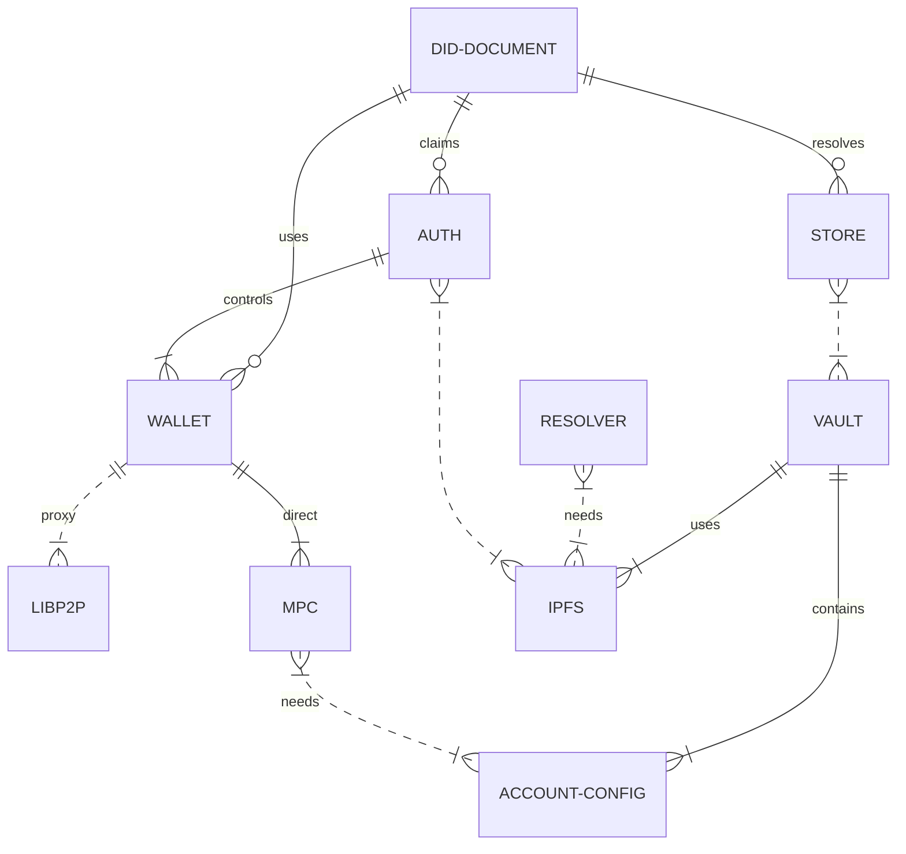
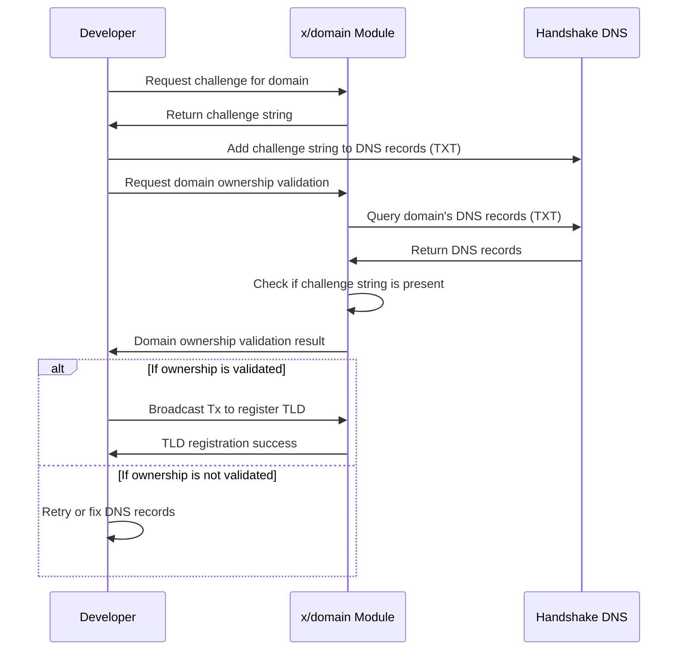
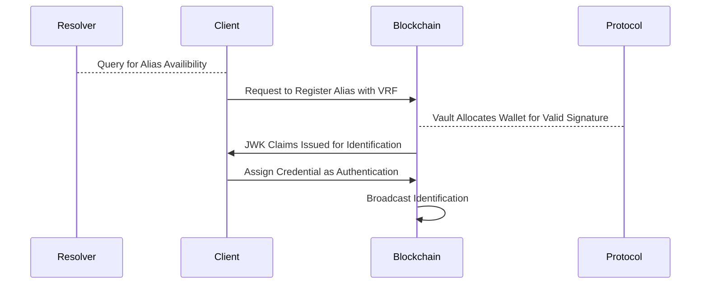
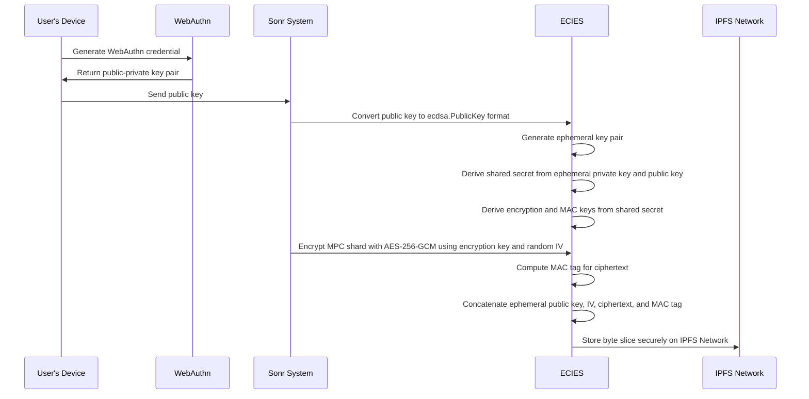

# Custom Chain Modules

## Introduction

> Sonr is a peer-to-peer identity and asset management system that leverages DID documents, Webauthn, and IPFS — providing users with a secure, user-friendly way to manage their digital identity and assets.

This document highlights the overall cryptographic mechanisms, token economy, and infrastructure system design involved in the Sonr Network, and blockchain.

### Network & Protocol

* **Libp2p —** For client communication with validator nodes
* **IPFS/FIL —** For persistent replicated storage

### Clients

* **WebAuthn** — For universal client key generation with native device biometrics

### Blockchain

Sonr is a Cosmos powered blockchain which is powered by a TenderMint validation mechanism. The default consensus for TenderMint is DPoS and works with our current ABCI implementation for Transaction Verification. DPoS is a twist on Proof of Stake consensus that relies upon a group of delegates to validate blocks on behalf of all nodes in the network . Witnesses are elected by stakeholders at a rate of one vote per share per witness . Coin age is irrelevant. All coins that are mature will add the same staking weight (usually 1 in the wallet hover display) Results in stable, consistent interest only for active wallets and only with small inputs.

### Utility of Token

Existing mechanisms for user identity with their lack of standardization have led to faulty solutions that source information from closed third-party sources. By introducing a new peer-to-peer network we solve this issue at the point of the device and leverage a blockchain system to verify User claims.

Sonr provides the utility of managing crypto assets, private identifiable information, and application specific data while having full W3C Decentralized Identifier compliance.

#### Delegated Proof of Stake (DPoS)

On Sonr we will be leveraging a **delegate stake** mechanism in order to **optimize buy-in** for users in the network. It imposes an **excess opportunity cost** if **slashing** is implemented.

With this being said, there are some challenges in implementing staking:

* The token must already have value
* Allocating power or influence via staking gives major edge to wealthy users
* They are frequently subject to gaming and coordination problems

However there is substantial benefit in incorporating a staking mechanism, with the following criteria met we can create a sustainable design:

1. The upfront capital required to stake should not significantly discourage them to stake
2. If a stakeholder group is making decisions that materially harm the network, they would be punished via slashing the stake.
3. Stakeholders can make decisions that positively impact the future network health and token price, therefore holding stake can promote positive Sonr growth

### Supply & Allocation

The initial pool of tokens to be distributed to the team and investors is `2,000,000,000 SNR`. This pool will be distributed as follows:

| Segment Distribution | Allocation | Tokens ($SNR) | Distribution at Launch | Periodic Distribution | Distribution Lock-Up Months | Vesting Months |
| -------------------- | ---------- | ------------- | ---------------------- | --------------------- | --------------------------- | -------------- |
| Community            | 50.00%     | 1,000,000,000 | See Below              | See Below             | See Below                   | See Below      |
| Core Team            | 15.00%     | 300,000,000   | 0                      | 300,000,000           | 24                          | 48             |
| P1 Sale              | 15.00%     | 280,000,000   | 0                      | 280,000,000           | 12                          | 24             |
| P2 Sale              | 15.00%     | 300,000,000   | 0                      | 300,000,000           | 24                          | 24             |
| Advisors             | 4.00%      | 80,000,000    | 0                      | 80,000,000            | 24                          | 24             |
| Public Sale          | 2.00%      | 40,000,000    | 0                      | 40,000,000            | N/A                         | N/A            |
| Total                | 100.00%    | 2,000,000,000 | 0                      | 2,000,000,000         | –                           | –              |

#### Community Breakdown

After launch the community portion of the token distribution will be distributed as follows:

| Segment Portion               | Allocation | Tokens (SNR) | Start Date | Initial Size | Growth Rate (YTD) | SNR Remaining |
| ----------------------------- | ---------- | ------------ | ---------- | ------------ | ----------------- | ------------- |
| Validator Node Subsidies      | 20.00%     | 200,000,000  | 6/1/2024   | 500,000      | -20%              | 101,250,036   |
| Ecosystem Grants              | 40.00%     | 400,000,000  | 3/1/2023   | 100,000      | 30%               | 121,194,148   |
| Highway Node Subsidies        | 4.00%      | 40,000,000   | 1/1/2024   | 150,000      | -20%              | 9,861,176     |
| Governance Proposal Subsidies | 6.00%      | 60,000,000   | 6/1/2024   | 100,000      | 0%                | 18,800,000    |
| Governance Voting Subsidies   | 6.00%      | 60,000,000   | 6/1/2024   | 100,000      | 0%                | 18,800,000    |
| Airdrops                      | 0.80%      | 8,000,000    | -          | -            | -                 | 7,500,000     |
| Reserve                       | 23.20%     | 232,000,000  | -          | -            | -                 | 232,000,000   |

### Module Structure

These components are then utilized to develop the core modules which facilitate the Sonr network.

| Highway Protocol                                             | x/identity                                                             | x/service                                                                          | x/oracle                                  |
| ------------------------------------------------------------ | ---------------------------------------------------------------------- | ---------------------------------------------------------------------------------- | ----------------------------------------- |
| Encrypted IPFS Storage with ECIES Asymmetric Key Encryption. | MPC Wallet Generation, DID Resolution and control, Interchain Accounts | Service Record management and registration, DNS Resolution and Record Verification | Token BuyBacks, Price Feed, and IBC Swaps |
| IBC Disabled (Private Module)                                | IBC Enabled                                                            | IBC Enabled                                                                        | IBC Enabled                               |

***

## `x/identity` — Decentralized Identity

Sonr's **x/identity** is a decentralized identity and asset management module that uses MPC Wallet Generation, DID Resolution, and Interchain Accounts to provide users with secure, user-friendly control over their data.

#### `Identification`

The generic representation of an account on the Sonr Blockchain. Each `Identification` contains a key for each potential verification relationship a `DIDDocument` could have and a string array of the associated Decentralized Identifiers.

During resolution each associated `VerificationMethod` is sourced from the Module’s store with the correct corresponding key-prefix for the relationship. This results in forming the fully populated `DIDDocument` which the client receives.

* Implements base `types.AccountI` implementation
* Utilized as Interchain Account for cross chain transfers
* Lighter data structure for faster query resolution in `n(1)` time

**Protobuf Definition — Stored On-Chain**

```protobuf
message Identification {
  string id = 1; 
  string owner = 2; 
  string primary_alias = 3; 
  repeated string authentication = 4;
  repeated string assertion_method = 5;
  repeated string capability_invocation = 6;
  repeated string capability_delegation = 7;
  repeated string key_agreement = 8;
  repeated string also_known_as = 9;
  string metadata = 10;
}
```

#### `DIDDocument`

The fully resolved document which contains all Verification Relationships associated with a user. This structure is not fully stored on chain in order to reduce the store size for the module.

* This document complies with the W3C specification for decentralized identifier resolution, construction, and storage.
* This makes Sonr’s DIDDocument’s network agnostic and resolvable in any network capable environment

**Protobuf Definition — Constructed during Query**

```protobuf
message DIDDocument {
	repeated string context = 1;
  string id = 2;
  repeated string controller = 3;
  repeated VerificationRelationship authentication = 5;
  repeated VerificationRelationship assertion_method = 6;
  repeated VerificationRelationship capability_invocation = 7;
  repeated VerificationRelationship capability_delegation = 8;
  repeated VerificationRelationship key_agreement = 9;
  repeated string also_known_as = 10;
  string metadata = 11;
}
```

#### `VerificationMethod`

A VerificationMethod represents a verification method that can be used to authenticate the DID subject or perform other cryptographic operations.

* Utilized for constructing Credential Descriptors
* Used to identify blockchain wallets and accounts which belong to an identification

\*\*\*\*\*\*\*\*\*\*\*\*\*\*\*\*\*\*\*\*\*\*\*\*\*\***Protobuf Definition — Embedded into a `VerificationRelationship`**

```protobuf
message VerificationMethod {
  string id = 1; 
  string type = 2; 
  string controller = 3; 
  string public_key_jwk = 4; 
  string public_key_multibase = 5; 
  string blockchain_account_id = 6; 
  string metadata = 7;
}
```

#### `VerificationRelationship`

The representation material for proving ownership over a set of cryptographic keys. Verification relationship’s represent a relationship between a verification method and a specific verification purpose (e.g., authentication, assertion, etc.).

* Implements base `types.AccountI` implementation
* Utilized as Interchain Account for cross chain transfers
* Lighter data structure for faster query resolution in `n(1)` time

**Protobuf Definition — Stored On-Chain**

```protobuf
message VerificationRelationship {
  VerificationMethod verification_method = 1; 
  string reference = 2; 
  string type = 3; 
  string owner = 4;
}
```

### Identity Keyshare System



Sonr's system leverages the powerful cryptographic technique of Multi-Party Computation (MPC) for secure wallet generation and DID (Decentralized Identifier) resolution. As part of this process, keyshares are generated which form an integral part of the MPC technique.

#### **Multi-Party Computation (MPC)**

In MPC, a secret value (in this case, a user's private key) is divided into a number of shares. These keyshares are such that any subset of them can be used to reconstruct the secret, but no single share reveals any information about the secret itself. This ensures that even if a malicious party gains access to a share, they can't derive any meaningful information about the private key.

#### Encrypted **Decentralized Storage**

The security and confidentiality of these keyshares are of paramount importance for the system's security. To ensure this, Sonr stores these keyshares in encrypted IPFS vaults. IPFS, or InterPlanetary File System, is a decentralized storage solution. Unlike traditional file storage systems, where files are located at specific server locations, IPFS identifies files based on their content, making it a robust and resilient system for storing information.

When a keyshare is generated in Sonr's system, it is encrypted and stored in an IPFS vault. This vault is then "pinned," meaning it is marked for preservation and can be retrieved reliably from the IPFS network. This approach combines the benefits of MPC's secure computation with IPFS's resilient storage to create a robust security model for managing digital identities and wallets.

***

## `x/service` — Application Services

The **x/service** Module of Sonr's system plays a crucial role in managing and authenticating user interactions with the network. It provides several key functionalities, including WebAuthn-based user authentication, Service Record management and registration, and DNS resolution and record verification.

#### `ServiceRecord`

The fully resolved document which contains all Verification Relationships associated with a user. This structure is not fully stored on chain in order to reduce the store size for the module.

**Protobuf Definition — Stored On-Chain**

```protobuf
message ServiceRecord {
  string id = 1;
  string controller = 2;
  string type = 3;
  string origin = 4;
  string name = 5;
  repeated string endpoints = 6;
  string metadata = 7;
}
```

#### `ServiceRelationship`

The ServiceRelationship is a relationship between a service and a User entity. This relation is used to track the number of times a user has interacted with a service, utilizing a verifiable random function (VRF) to generate a random number that is used to determine whether or not a user has access to a service.

**Protobuf Definition — Stored On-Chain**

```protobuf
message ServiceRelationship {
  string reference = 1;
  string did = 2;
  uint32 count = 3;
}
```

### DNS Record Verification



The most basic cryptographic mechanism employed by Sonr is for TXT record verification of origin urls. In order for a service to have the ability to engage with the Sonr network the client needs to deploy a Service Record with a valid, resolvable origin url. The validator node provides the client with a challenge in order to verify ownership of the domain and to insert as a record on their domains DNS routing table. _This mechanism is subject to change, as the Sonr core team look’s for a more scaleable, decentralized approach._

### Verifiable Random User Assertion



Sonr incorporates a Verifiable Random Function (VRF) in the process of generating assertion options for users. The key purpose of this mechanism is to provide privacy-preserving user authentication activity that is verifiable but not publicly displayed on the chain.

A VRF operates like a regular hash function, but with an added feature: it provides a proof of the randomness. This proof ensures that the random number was generated by the specific private key holder and could not have been tampered with or predicted in advance.

When a user requests assertion options from a validator node in the Sonr network, the VRF is employed to generate a challenge. This challenge is unique, unpredictable, and cannot be precomputed or reused. The output from the VRF is used to create the challenge, and a corresponding proof is generated.

The proof and the challenge are then sent back to the user. The user verifies the proof against the validator's known public key before continuing. This way, the user can be assured that the challenge was created freshly by the validator and has not been tampered with during transit.

The challenge is kept private, providing privacy to the user's authentication activity. Simultaneously, the deterministic nature of the VRF ensures that any disputes can be resolved, as anyone can use the proof and the validator's public key to confirm the challenge's correctness.

***

## `rails:highway` — Secure Vaults

The **x/vault** Module is a private module which manages the encryption, storage, and retrieval of sensitive data in the Sonr network.

### Incorporation of WebAuthn

WebAuthn is a web standard published by the World Wide Web Consortium (W3C) for strong user authentication. It's typically used to replace or supplement password-based authentication with public key cryptography, providing a way for users to prove their identity to a service without transmitting a shared secret over the network.

However, in our system, we use WebAuthn for a different purpose: secure key storage and encryption. Specifically, we use the public-private key pair associated with a WebAuthn credential as the basis for an encryption scheme, with the private key securely stored on the user's device and the public key stored on the Authentication field of the User’s DID Document.

In the context of Sonr, the data that WebAuthn encrypts is the associated Multi-Party Computation (MPC) shard for the device. The MPC shard, a piece of data crucial for the operation of our system, must be kept private and secure. By using WebAuthn for encryption, we can ensure that the MPC shard is only accessible to the legitimate owner of the device. When linking a new device, we regenerate the pool of MPC shares and add an additional share to be mapped for the new Device credential.

### ECIES Asymmetric Encryption

ECIES (Elliptic Curve Integrated Encryption Scheme) is a cryptographic protocol that uses elliptic curve cryptography to secure data transmission. It allows a sender to encrypt a message using the recipient's public key in a way that ensures only the recipient, who possesses the corresponding private key, can decrypt and access the message, thereby providing confidentiality in message exchange.



To achieve encryption, we employ an Elliptic Curve Integrated Encryption Scheme (ECIES). In this process, we first convert the public key from the WebAuthn credential from `webauthncose.EC2PublicKeyData` format to `ecdsa.PublicKey` format. Following this, we generate an ephemeral key pair and derive a shared secret from the ephemeral private key and the public key. Using the derived shared secret, we then derive encryption and MAC (Message Authentication Code) keys. The MPC shard is then encrypted with AES-256-GCM using the derived encryption key and a randomly generated IV (Initialization Vector). A MAC tag is also computed to ensure the integrity of the `ciphertext`.

The final output of this process is a single byte slice that concatenates the encoded ephemeral public key, the IV, the `ciphertext`, and the MAC tag. This byte slice is then stored securely on the IPFS Network.

### Wallet-to-Wallet Messaging

In Sonr, different types of data require different levels of security. To ensure that data is protected according to its sensitivity, keys are derived using a KDF based on their specific use cases. For instance, separate keys are derived for inbox messages, push notifications, and MPC shards.

A KDF, such as PBKDF2 or HKDF, takes an input (or 'password') and produces a derived key. By inputting different parameters for each use case, we can produce distinct keys for each application. This ensures that a compromise in one area, such as a user's inbox messages, would not lead to a compromise in another, such as their MPC shards.

The NaCl secret box is used for encrypting and decrypting messages. The 'secret box' construct in NaCl provides authenticated encryption. This means that data is not only kept confidential, but also that any tampering with the data can be detected.

#### **NACL Secret Box**

In the context of Sonr, the sender encrypts the message using the recipient's public key and their own private key. The encrypted message can then be safely sent across the network, secure in the knowledge that only the recipient, with their corresponding private key, can decrypt it.

#### Sonr File System (SFS)

The SFS is a distributed file system that provides a high-throughput, content-addressed block storage model, with content-addressed hyperlinks. This forms the basis for a decentralized version of a traditional hierarchical file system.

Within the SFS, user data such as inbox messages, push notifications, and MPC shards are stored in an encrypted form. Only the user, with their derived keys, can access and decrypt their own data.

### Service-to-Wallet Messaging

Sonr offers a unique feature for applications authenticated with a service: Service-to-Wallet Messaging. This is an innovative method for application providers to communicate directly with their users in real-time. The system is facilitated by the **`x/vault`** module, providing a seamless integration between service providers and users.

Upon authentication with a service, applications join a peer-to-peer (P2P) channel. This channel is generated deterministically from a record identifier stored on-chain, ensuring a secure and reliable connection between the service provider and the user's wallet.

This P2P channel acts as a conduit for the service-to-wallet communication, allowing for direct, real-time notifications from the application provider to the user. Moreover, a new inbox is created for each authenticated application, ensuring application-specific messages are organized and easy to manage.

#### Offline Notifications

Additionally, Sonr supports an offline notification mechanism. If a user is not currently online or their wallet is not active, the application can still send a message. The message is stored and then delivered to the user's wallet once they reconnect. This ensures no important notifications are missed due to network issues or user availability.
